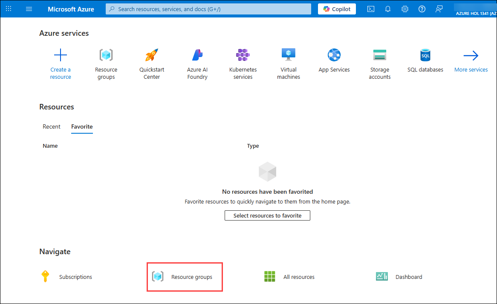
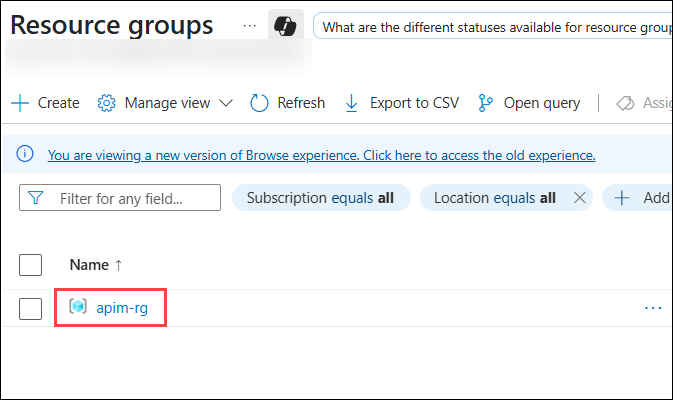
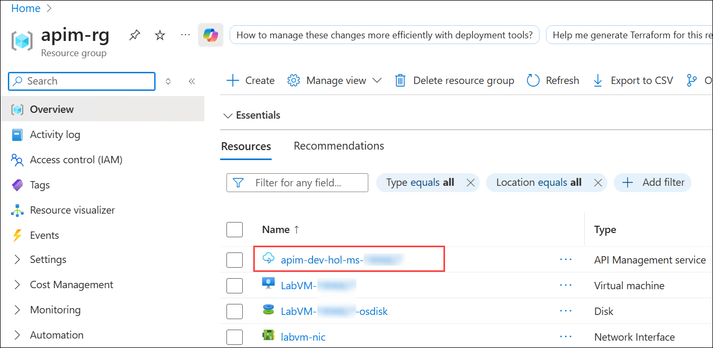
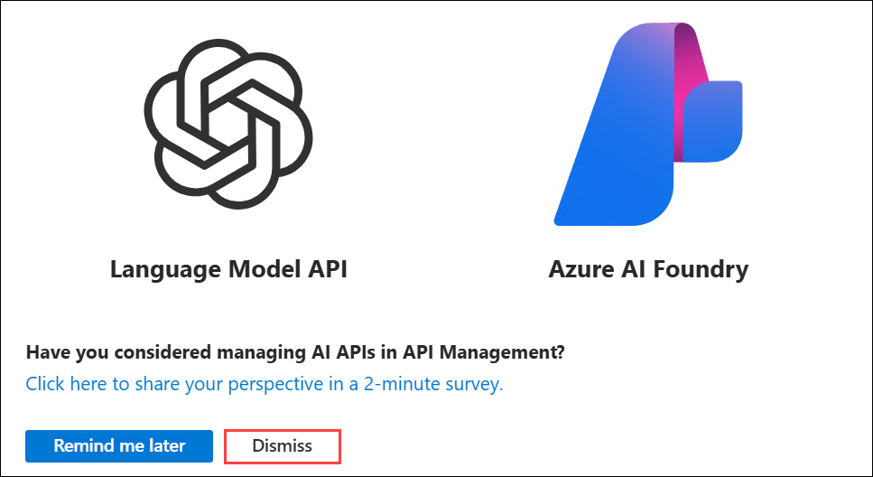
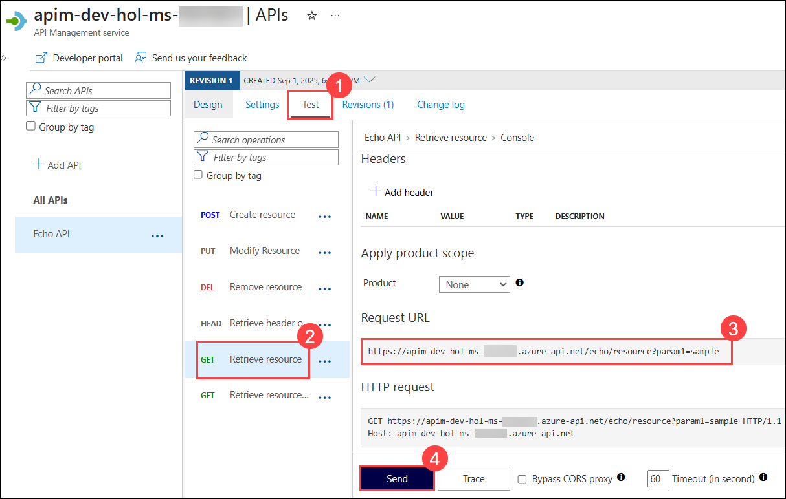
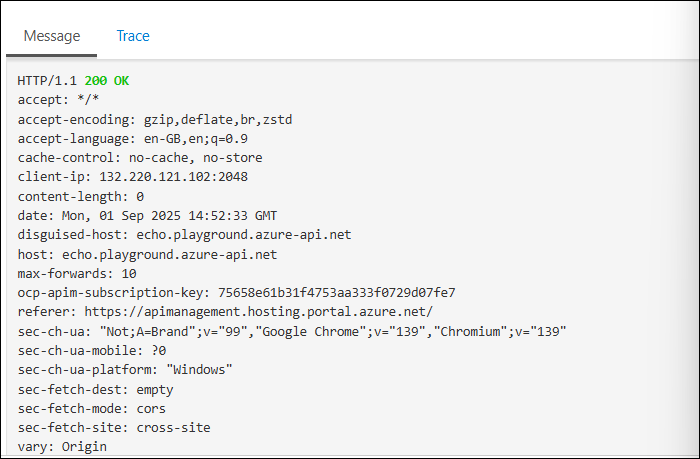
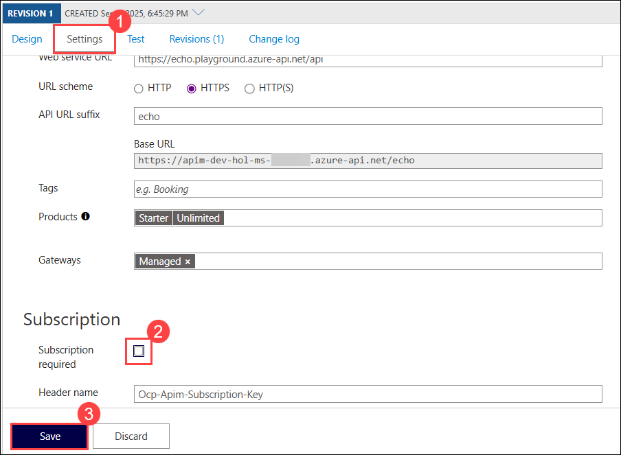
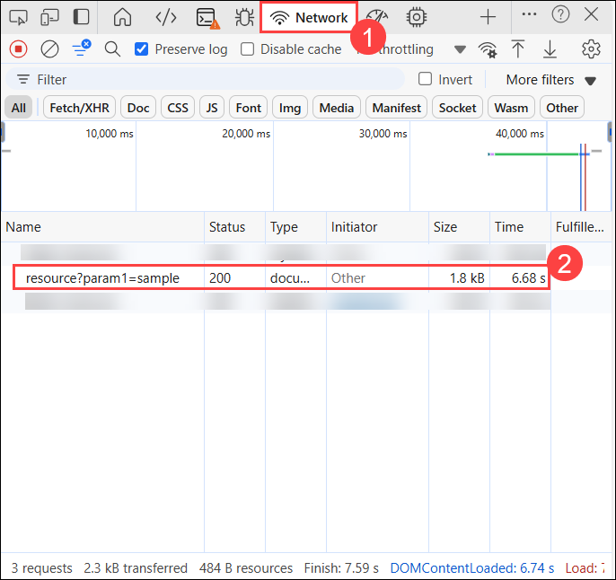

# Exercise 1: Verify API Management Instance

### Estimated Duration: 30 Minutes

## Overview

In this exercise, you will verify that your Azure API Management (APIM) instance is deployed and functioning correctly. You will navigate the Azure Portal to locate your APIM resource, add a sample Echo API, test its operation, and troubleshoot common issues such as authentication errors. This foundational step ensures your APIM environment is ready for further API development and management tasks.

## Objectives

In this exercise, you will perform:

- Task 1: Verifying the Azure API Management instance
- Task 2: Accessing the Request URL.

### Task 1: Verifying the Azure API Management instance 

In this task, you will access the pre-deployed Azure API Management instance and access it from the Azure portal. 

1. Navigate to the **Resource groups** in the Azure Portal and select the **apim-rg** resource group.

   

   

1. On the resource groups **apim-rg**, select API Management service resource type with name **apim-dev-hol-ms-<inject key="Deployment ID" enableCopy="false" />**. 
   
   

1. If the **Have you considered managing Al APIs in API Management?** pop-up window appears, click on **Dismiss**.

   

1. Now we will verify that the Azure API Management instance functions correctly. Expand the **APIs (1)** section from the left pane and click on **APIs (2)**. Select the existing **Echo API (3)**. 

   

1. In the **Echo API** go to the **Test (1)** tab, then select the **GET Retrieve resource (2)** operation. Note down the **Request URL (3)** in a Notepad for later use. Press **Send (4)** to issue a simple request.

   

1. Scroll down and observe the **200 Success HTTP** response.

   

You have successfully confirmed that Azure API Management is now set up!

### Task 2: Accessing the Request URL.

In this task, you will access the Request URL of the Echo API directly from a web browser. 

1. Try accessing the Request URL which we copied in the previous task in a browser window. You will notice that the URL issue as a `401 Unauthorized` error.

   

1. The reason for this unauthorized access status code is that the *Echo API* requires a subscription key to be set. Whereas tests originating in Azure API Management account for this automatically, external callers cannot (and, naturally, should not).

1. Navigate back to APIM in the portal, switch to the **Settings (1)** tab, uncheck **Subscription required (2)**, and press **Save (3)** at the bottom of the page.

   

1. Subscriptions are important and useful, but in this exercise, we just want to verify the Azure API Management instance is working as intended.

1. Now, access the Request URL again in a new browser tab. In order to verify the status, open the Developer Tools by clicking on the **ellipsis (...) (1)** on the top right corner of your browser. Select **More tools (2)** and then **Developer tools (3)**.

   

1. Navigate to the **Network (1)** tab, and refresh the browser page once. You will see the status of the request as **200 (2)**.

   

1. Alternatively, search for the **Command Prompt (1)** in the **windows search bar**, Open the **Command Prompt (2)** and paste the command mentioned below you can issue a verbose (`-v`) **CURL command (3)** against the **Echo API** and observe the **`200` Success (4)** status code in the output:

   ```
   curl -v https://apim-dev-hol-ms-<inject key="Deployment ID" enableCopy="false" />.azure-api.net/echo/resource
   ```

   
     
   

   > **Congratulations** on completing the task! Now, it's time to validate it. Here are the steps:
   > - If you receive a success message, you can proceed to the next task.
   > - If not, carefully read the error message and retry the step, following the instructions in the lab guide. 
   > - If you need any assistance, please contact us at cloudlabs-support@spektrasystems.com. We are available 24/7 to help you out.

      <validation step="a68aef90-9b22-4d42-98cb-9ea25d35a217" />

## Summary

In this exercise, you verified the setup and functionality of the Azure API Management instance by testing the Echo API and handling any issues related to subscription keys. This ensures that your API management environment is correctly configured and ready for further use. You are now prepared to proceed to the next exercise to deepen your understanding and management of APIs.

### You have successfully completed the exercise. Click on **Next >>** to proceed with the next exercise.

  
