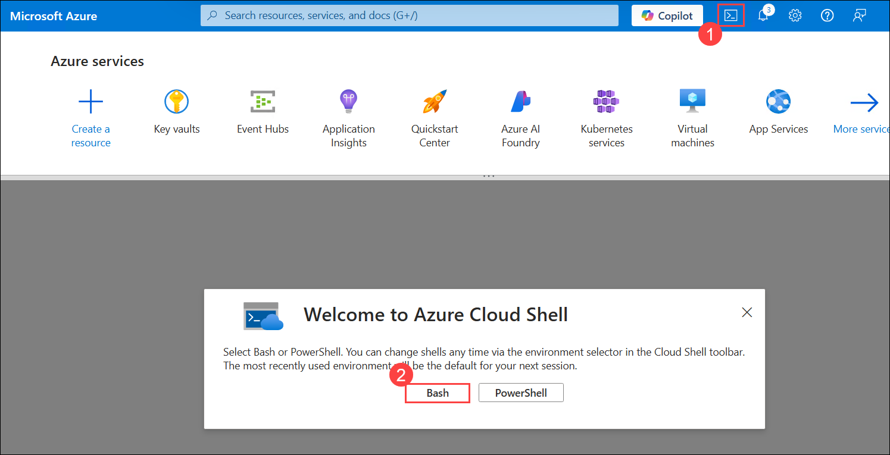
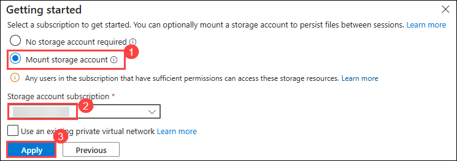
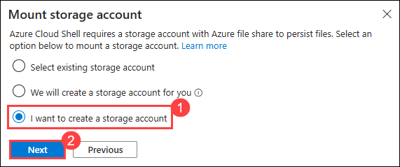

## Exercise 8 Task 2: Provision your own instance of ColoursWeb/ColoursAPI

In this task, we will show you how to deploy your own instances of the Colours Web and Colours API. Note - ColoursWeb / ColoursAPI is a new version of ColorsWeb/ColorsAPI, do not mix the web client and API versions.

Some of the demos use the ColoursWeb web application and the ColoursAPI API application. 

The code for the ColoursWeb / ColoursAPI applications is available here:

- [ColoursWeb](https://github.com/markharrison/ColoursWeb)
- [ColoursAPI](https://github.com/markharrison/ColoursAPI)

Docker Containers exist for these applications and so provide an easy deployment option.

> IMPORTANT: Due to the new pull restrictions on Docker Hub images, in this exercise, we will be using the GitHub registry

- Github (Colours)
  - `docker pull ghcr.io/markharrison/coloursapi:latest`
  - `docker pull ghcr.io/markharrison/coloursweb:latest`
- DockerHub (Colors)
  - `docker pull markharrison/colorweb:latest`
  - `docker pull markharrison/colorapi:latest`

With the container, we can deploy to multiple hosting options: VM's, App Services, ACI, and also AKS. In this lab, we are going to show you how to do it with [Azure Container Instances](https://docs.microsoft.com/en-us/azure/container-instances/).

### Task 2.1: Deploying Web and API containers with Azure Container Instances

1. Open the **Azure Cloud Shell (1)** and choose **Bash (2)**.

     

1. The first time Cloud Shell is started it will require you to create a storage account.

   - Select **Mount storage account (1)**.
   - Select the **subscription (2)**, and click **Apply (3)**.

     

   - Select **I want to create a storage account (1)**, and click on **Next (2)**.

     

   - Select Resource Group: **apim-rg (1)**
   - Region: **East US (2)**
   - Storage account name: **apim<inject key="Deployment ID" enableCopy="false" /> (3)**
   - Fileshare name: **apim (4)**
   - Click on **Create (5)**

       
   
1. We proceed to create a unique identifier suffix for resources created in this Lab:

   - Define the existing resource group name

     ```
     APIMLAB_RGNAME=apim-rg
     ```

   - Define other variables

     ```
     APIMLAB_UNIQUE_SUFFIX=$USER$RANDOM
     APIMLAB_LOCATION=eastus
     APIMLAB_COLORS_WEB=mycolorsweb-$APIMLAB_UNIQUE_SUFFIX
     APIMLAB_IMAGE_WEB=ghcr.io/markharrison/coloursweb:latest
     APIMLAB_DNSLABEL_WEB=acicolorweb$APIMLAB_UNIQUE_SUFFIX
     APIMLAB_COLORS_API=mycolorsapi-$APIMLAB_UNIQUE_SUFFIX
     APIMLAB_IMAGE_API=ghcr.io/markharrison/coloursapi:latest
     APIMLAB_DNSLABEL_API=aci-color-api-$APIMLAB_UNIQUE_SUFFIX
     ```

   - Unique suffix is assigned.

     ```
     APIMLAB_UNIQUE_SUFFIX="${APIMLAB_UNIQUE_SUFFIX//_}"
     APIMLAB_UNIQUE_SUFFIX="${APIMLAB_UNIQUE_SUFFIX//-}"
     ```

   - Check Unique Suffix Value (Should be No Underscores or Dashes)

     ```
     echo $APIMLAB_UNIQUE_SUFFIX
     ```

   - Persist for Later Sessions in Case of Timeout

     ```
     echo export APIMLAB_UNIQUE_SUFFIX=$APIMLAB_UNIQUE_SUFFIX >> ~/.bashrc
     echo export APIMLAB_RGNAME=$APIMLAB_RGNAME >> ~/.bashrc
     echo export APIMLAB_LOCATION=$APIMLAB_LOCATION >> ~/.bashrc
     echo export APIMLAB_COLORS_WEB=$APIMLAB_COLORS_WEB >> ~/.bashrc
     echo export APIMLAB_IMAGE_WEB=$APIMLAB_IMAGE_WEB >> ~/.bashrc
     echo export APIMLAB_DNSLABEL_WEB=$APIMLAB_DNSLABEL_WEB >> ~/.bashrc
     echo export APIMLAB_COLORS_API=$APIMLAB_COLORS_API >> ~/.bashrc
     echo export APIMLAB_IMAGE_API=$APIMLAB_IMAGE_API >> ~/.bashrc
     echo export APIMLAB_DNSLABEL_API=$APIMLAB_DNSLABEL_API >> ~/.bashrc
     ```

   - Generate a DNS label that meets the criteria

     ```
     APIMLAB_DNSLABEL_WEB="acicolorweb$(echo "$APIMLAB_UNIQUE_SUFFIX" | tr -cd '[:alnum:]' | cut -c 1-57)"
     ```

   - Generate a container name that meets the criteria

     ```
     APIMLAB_COLORS_WEB="mycolorsweb-$(echo "$APIMLAB_UNIQUE_SUFFIX" | tr -cd '[:alnum:]' | cut -c 1-55)"
     ```

1. Create the container instance for the colors web:

      ```  
      az container create --resource-group $APIMLAB_RGNAME --name $APIMLAB_COLORS_WEB --image $APIMLAB_IMAGE_WEB --os-type Linux --cpu 2 --memory 3.5 --dns-name-label $APIMLAB_DNSLABEL_WEB --ports 80 --restart-policy OnFailure --no-wait
      ```

1. Now we run the following command to check the status of the deployment and get the FQDN to access the app:

    ```bash
    az container show --resource-group $APIMLAB_RGNAME --name $APIMLAB_COLORS_WEB --query "{FQDN:ipAddress.fqdn,ProvisioningState:provisioningState}" --out table
    ```

    The output should something like this:

      ```
      FQDN                                                  ProvisioningState
      ----------------------------------------------------  -------------------
      aci-color-web-fernando22287.eastus.azurecontainer.io  Succeeded
      ```

      

      >**Note:** If the status is showing as pending, wait for a few minutes and run the command again.

1. Once you see the 'Succeeded' message, copy the generated FQDN URL and open it in a new browser tab. You should now see the homepage of the Colours Web application.

   >**Note**: If you receive a message stating that the site does not have a secure connection, click on **Continue to site** to proceed.

      

1. Go back to cloudshell, to generate a DNS label that meets the criteria for color-api
  
     ```
     APIMLAB_DNSLABEL_API="aci-color-api-$(echo "$APIMLAB_UNIQUE_SUFFIX" | tr -cd '[:alnum:]' | cut -c 1-53)"
     ```

1. Create a valid container name for color-api

     ```
     APIMLAB_CONTAINER_NAME="mycolorsapi-$(echo "$APIMLAB_UNIQUE_SUFFIX" | tr -cd '[:alnum:]' | cut -c 1-55)"
     ```

1. Now we proceed to create the ACI for the colors-api GitHub container:

   ```
   az container create --resource-group $APIMLAB_RGNAME --name $APIMLAB_CONTAINER_NAME --image $APIMLAB_IMAGE_API --os-type Linux --cpu 2 --memory 3.5 --dns-name-label $APIMLAB_DNSLABEL_API --ports 80 --restart-policy OnFailure --no-wait
   ```

1. Now we run the following command to check the status of the deployment and get the FQDN to access the app:

   ```
   az container show --resource-group $APIMLAB_RGNAME --name $APIMLAB_CONTAINER_NAME --query "provisioningState" --query "{FQDN:ipAddress.fqdn,ProvisioningState:provisioningState}" --out table
   ```

   The output should something like this:

   ```
   FQDN                                                  ProvisioningState
   ----------------------------------------------------  -------------------
   aci-color-api-fernando22287.eastus.azurecontainer.io  Succeeded
   ```

   

    >**Note:** If the status is showing as pending, wait for a few minutes and run the command again.  

1. Once you see the 'Succeeded' message, copy the generated FQDN URL and open it in a new browser tab. And we should see our home page (Swagger UI) for our Colours API:

   >**Note**: If you receive a message stating that the site does not have a secure connection, click on **Continue to site** to proceed.

   
---
## Summary

In this Task, you have deployed Azure Container Instances (ACI) for both the Colours Web and Colours API applications using GitHub container images. Then you accessed the applications via fully qualified domain names (FQDNs) to verify successful deployment and functionality.

### Now, click on Next from the lower right corner to move on to the next page for further tasks of Exercise 9.

  
