## Exercise 9 Task 3: API Proxy to Serverless

In this task, we will show you how to deploy serverless services and expose them via Azure API Management.

Azure Serverless (Functions and Logic Apps) can be configured to benefit from the advantages of Azure API Management.

### Task 3.1: Azure Functions

1. Search and select for **Function App**  in the portal, click on **+ Create**. Select **Consumption (1)** option and click on **Select (2)**.

   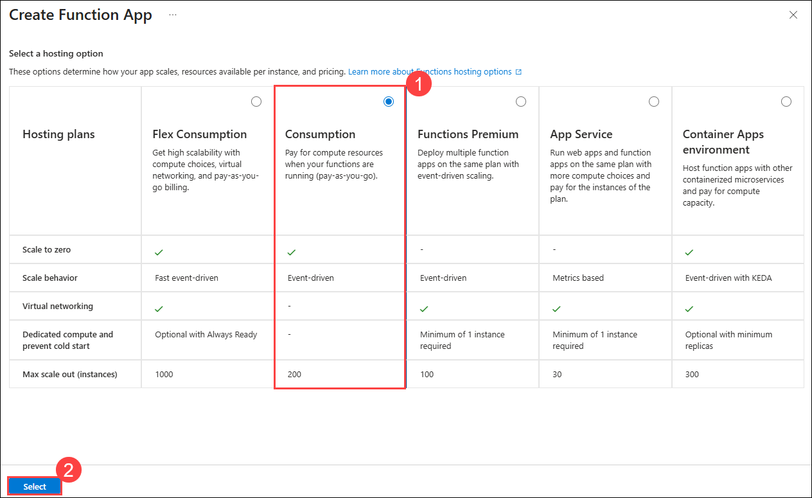

1. On the **Create Function App** page, enter the following details:

   - Subscription: Select the default subscription **(1)**
   - Resource group: **apim-rg (2)**
   - Function name : **func-<inject key="Deployment ID" enableCopy="false" />** **(3)**
   - Operating System : **Windows (4)**
   - Runtime stack : Select **.Net (5)**
   - Version : **8(LTS), isolated worker model (6)**
   - Region: **Select the default region (7)**
   - Click on **Review + create (8)**

      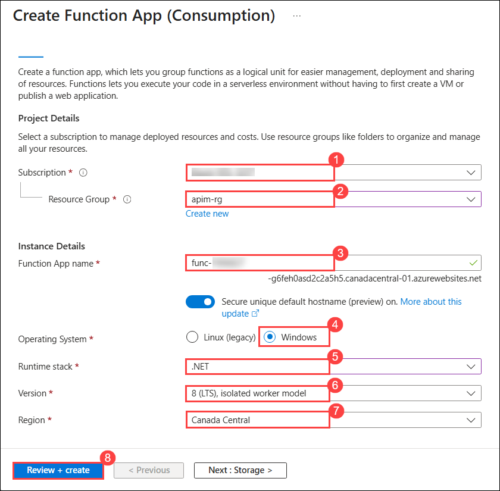

1. Click on **Create**.  Once the Resource is created, click on **Go to resource**.
   
1. Open **Visual Studio Code** from your LabVM.

   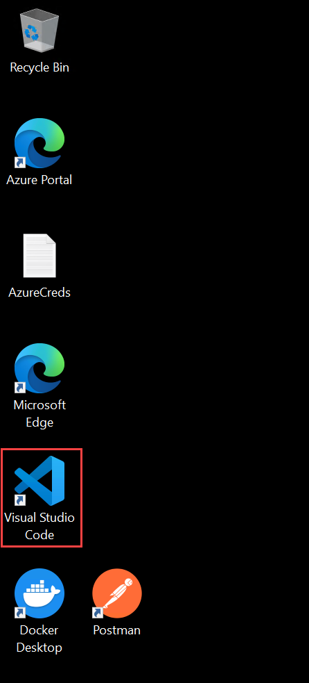

1. Click on **Azure shaped icon (1)** and click on **Azure Functions (2)** and select **Create Function..(3)**.

      

1. Please follow these steps after clicking on Create Function:
    
    - Navigate to `C:/LabFiles/` and select the **functions** folder.
    - Select a language: **C#**
    - Select a .NET runtime: **.NET 8.0 Isolated LTS**
    - Select a template for your project's first function: **HTTP trigger**
    - Provide a function name: **GetRandomColor**
    - Provide a namespace: **Select the default**
    - AccessRights: **Function**
    - Select how you would like to open your project: **Open in current window**

1. Click on **Yes, I trust the authors** when prompted.

   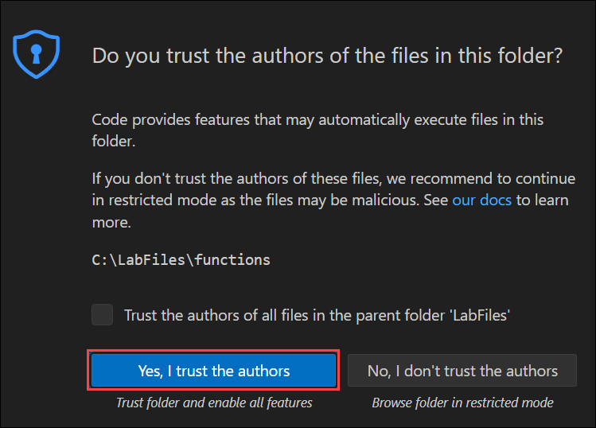

1. Replace the code in the `GetRandomColor.cs` file with the code mentioned below. 

      ```c#
      using Microsoft.AspNetCore.Http;
      using Microsoft.AspNetCore.Mvc;
      using Microsoft.Azure.Functions.Worker;
      using Microsoft.Extensions.Logging;

      namespace Company.Function;

      public class GetRandomColor
      {
         private readonly ILogger<GetRandomColor> _logger;

         public GetRandomColor(ILogger<GetRandomColor> logger)
         {
            _logger = logger;
         }

         [Function("GetRandomColor")]
         public IActionResult Run([HttpTrigger(AuthorizationLevel.Function, "get", "post")] HttpRequest req)
         {
            _logger.LogInformation("C# HTTP trigger function processed a request.");
            //string[] strColors = { "blue", "lightblue", "darkblue" };
            string[] strColors = { "green", "lightgreen", "darkgreen" };

            Random r = new Random();
            int rInt = r.Next(strColors.Length);

            return  (ActionResult)new OkObjectResult(strColors[rInt]);
         }
      }
      ```

      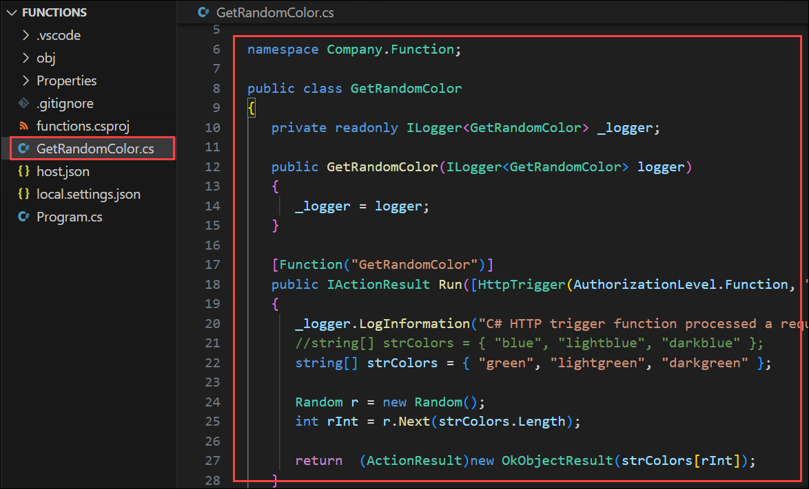

1. After replacing the code, save the file by clicking on **File** and then **Save**, or you can use the shortcut **Ctrl+S**.

1. Click on the **Azure tab (1)** in VS Code and select the **Sign in to Azure (2)** option.

   

1. On the Visual Studio Code pop-up, click on **Allow**.

   

1. Use the Azure credentials provided in the environment to log in.

   >**Note:** On the Automatically Sign in to all desktop apps and websites on this device? prompt, select **No, this app only**.

1. Now, we are going to publish the function to Azure. Navigate to the **Azure tab** in VS Code. Click on the **Azure functions (1)** icon and select **Deploy to Azure... (2)**.

      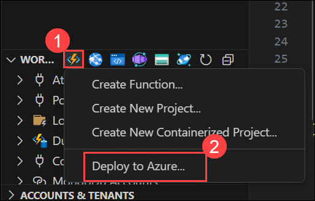
         
    - Select a function app: **func-<inject key="Deployment ID" enableCopy="false" />** 
    - Click on **Deploy** when prompted.
    - Wait until the deployment is successful

         .png)

         .png)

15. Let's add the function to Azure API Management. Navigate back to the **API Management service**, in the **API blade (1)** select **+ Add API (2)** and the **Function App tile (3)**.

       

1. On the **Create from Function** page select **Full** and click on the **Browse** button to get a list of Functions in the subscription

      

1. In the **Import Azure functions** page, click on **Select** on the right side. On the Select Azure Function app window, select your **Function App (1)** and click on **Select (2)**. Then select the **Function (3)** and click on **Select (4)**.

      

      

1. You can keep Name / Descriptions, URL suffix as default, and select the **Starter** and **Unlimited** **(1)** for the Products. Then click on **Create (2)**.

      

1. Validate the function works - either from the Azure management portal or the developer portal: Click **Test (1)**, select **GET GetRandomColor (2)**, and click **Send (3)**.

   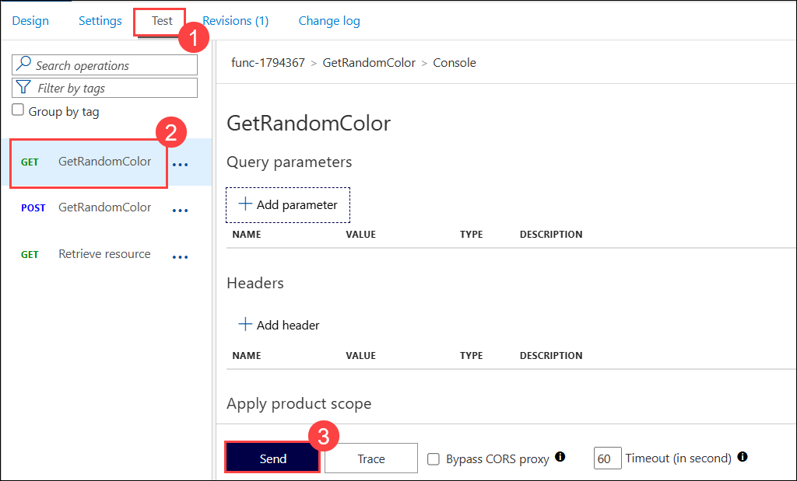

   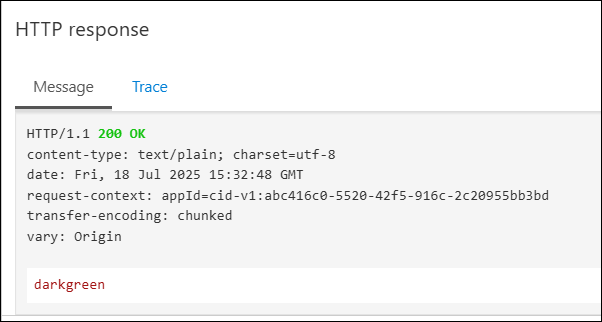

   > **Congratulations** on completing the task! Now, it's time to validate it. Here are the steps:
   > - If you receive a success message, you can proceed to the next task.
   > - If not, carefully read the error message and retry the step, following the instructions in the lab guide. 
   > - If you need any assistance, please contact us at cloudlabs-support@spektrasystems.com. We are available 24/7 to help you out.
         
   <validation step="b25ed567-5d6a-4ddf-a9e0-dee66fcf78d7" />

### Task 3.2: Azure Logic Apps

1. We will be creating a simple logic app that is triggered by an HTTP Request

1. Search for **Logic Apps** in the Azure portal search bar and select it, and click on **+ Add (1)**. On the Create Logic App page, click on **Consumption (3)** and **Select (3)**.

   

   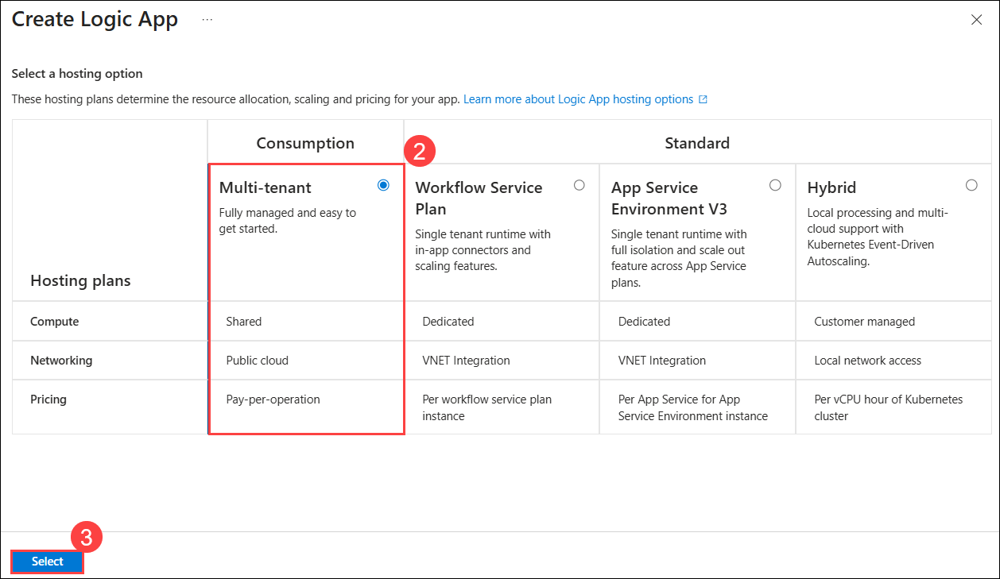
  
1. On the **Create Logic App (Multi-tenant)** page, enter the following details:

   - Subscription: Select the default subscription **(1)**
   - Resource group: **apim-rg (2)**
   - Logic App Name: **logicapp-<inject key="Deployment ID" enableCopy="false" />** **(3)**
   - Region: Select the regions you have used for pthe revious task **(4)**
   - Click on **Review + create (5)** then click on **Create**.

      

1. Once the Resource is created click on **Go to resource**, from the left menu under Development Tools select **Logic app designer (1)** and click on **Add a trigger (2)**.

   

1. In the logic app designer **search (1)** and **select (2)** **when a HTTP request is received**.

   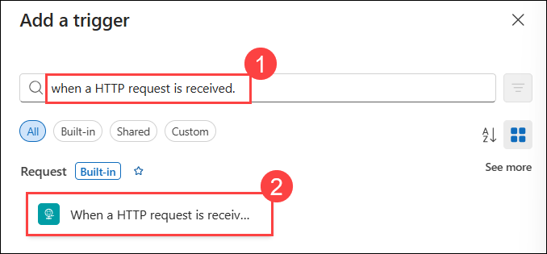

   - In the Request body JSON Schema **insert the following JSON (1)**. Click on + icon in the designer and select **+ Add an Action (2)**.

      ```
      {
      "type" : "object",
      "properties" : {
            "msg": {
               "type" : "string"
            }
      }

      }
      ```

      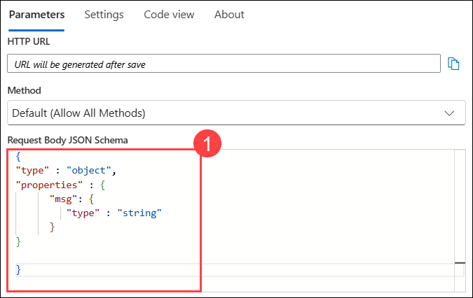

      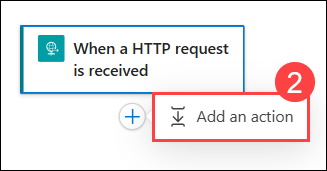

1. Search for **Azure Functions (1)**, and select the **Choose an Azure function (2)** and then select the function that you have created previously.

   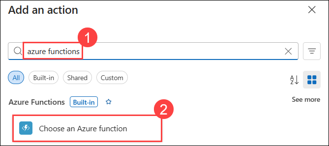

1. Now select the **Function App (1)** and the **Function (2)** and click on **Add action (3)**.

   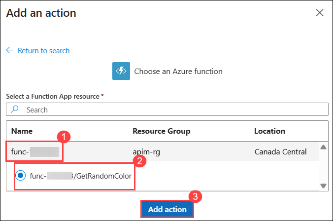

1. Add a new action to send email by clicking on the **+** icon, search for **Send an email (1)**, and select **Send an email (V2) (2)** under Office 365 Outlook. Click on **Sign in** and sign in using the environment credentials

   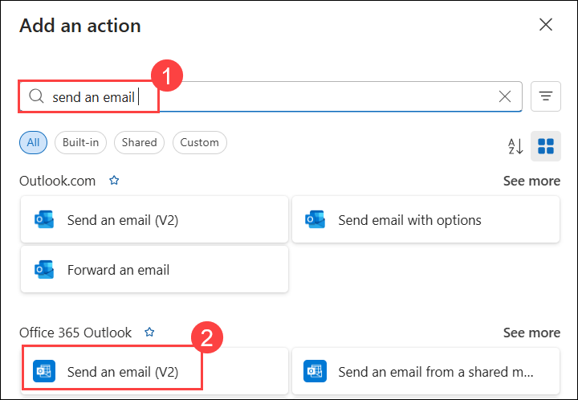

   - **To**: Specify your Email address, i.e. **<inject key="AzureAdUserEmail"></inject>** to receive the e-mail.

   - **Subject**: **Color**

   - **Body**: type **msg (1)**, **:** and click on add dynamic content **(2)**, select **msg**. Similarly, type **Color**, **:** and click on add dynamic content, search **body** and select **body** which is present in **Azure function**.

        

        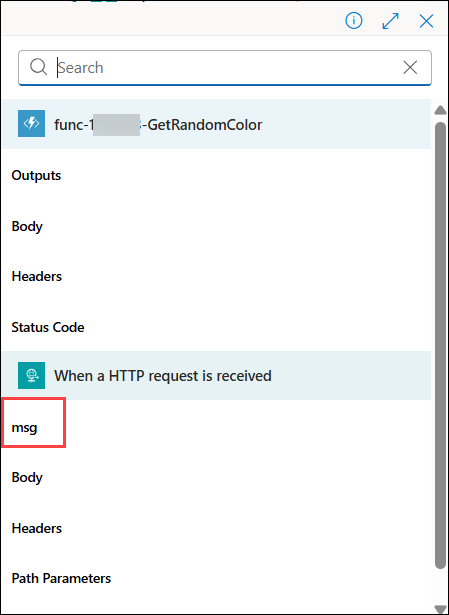

1. Select **+** to add a new action, search and select **Response**, now **Save** the logic App.

   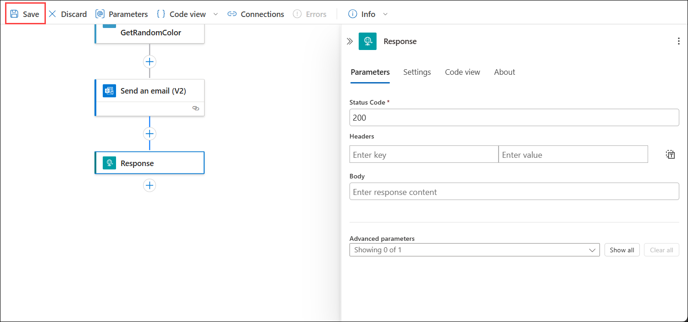

   - Use the following sample message to generate the schema of the Request body payload.  By specifying the schema, the individual fields (in this case, `msg`) can be extracted and referred to in the subsequent logic

      ```json
      {
      "msg": "text"
      }
      ```

1. Let's add the logic app to API Management. In the API blade select **+ Add API (1)** and the **Logic App (2)** tile

   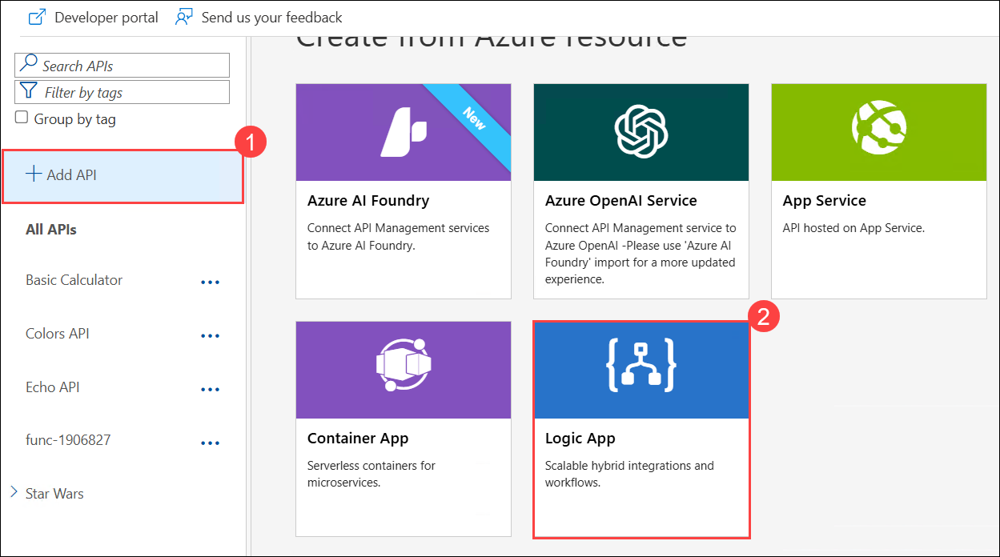

   - Select the **Browse** button to get a list of **Logic Apps** in the subscription

      

   - Select the **Logic App**, and choose **Select**.

      .png)

   - On the **Create from Logic App** screen, choose **Full (1)**. Keep the existing Name and Description, set the URL suffix to **logicapp (2)**, select the **Starter** and **Unlimited (3)** products, and then click **Create (4)**.

      .png)

1. Validate the Logic App works - either from the Azure management portal or the developer portal. Click **Test (1)**, select **GET GetRandomColor (2)**, and click **Send (3)**.

      

      

1. Navigate to your logic app. Go to **Run history** under Development tools from the left menu. Click the latest run and verify all steps in the flow are completed successfully.

      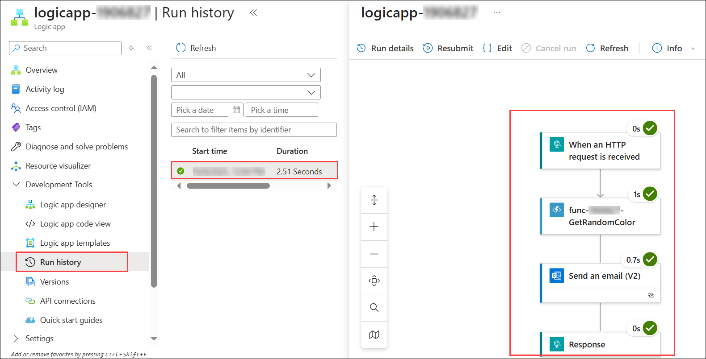

1. Log in to [outlook](https://www.microsoft.com/en-gb/microsoft-365/outlook/email-and-calendar-software-microsoft-outlook?deeplink=%2fowa%2f&sdf=0) using the Azure credentials and check that the email was sent

      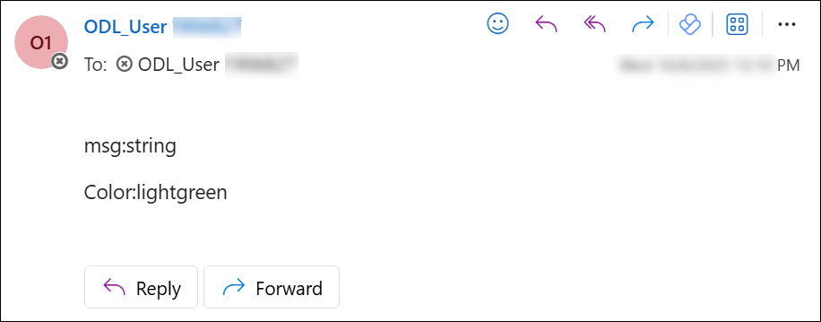

--- 
   > **Congratulations** on completing the task! Now, it's time to validate it. Here are the steps:
   > - If you receive a success message, you can proceed to the next task.
   > - If not, carefully read the error message and retry the step, following the instructions in the lab guide. 
   > - If you need any assistance, please contact us at cloudlabs-support@spektrasystems.com. We are available 24/7 to help you out.
         
   <validation step="c60e228d-7a4a-49bb-a8da-dfa8c1415230" />

## Summary

In this task, you have integrated Azure Functions and Logic Apps with Azure API Management, exposing them as APIs with management capabilities. you have configured, tested, and audited these serverless resources within API Management for seamless integration with other services.

### Now, click on Next from the lower right corner to move on to the next page for further tasks of Exercise 9.

  
