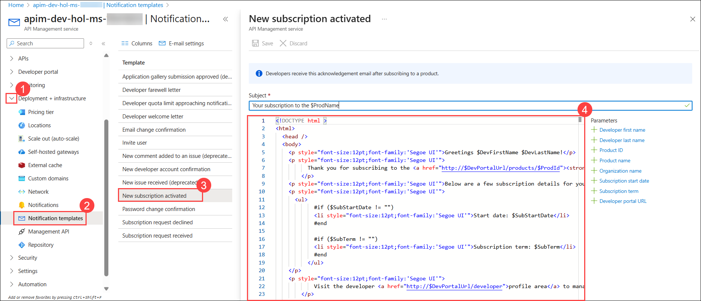

## Exercise 2 Task 4: Customizing the Developer Portal

### Task 4: Customizing the Developer Portal 

The Developer Portal is built on a customized [Paperbits Web framework](https://paperbits.io/) with Azure API Management enhancements (the fork resides in this repo - [GitHub](https://github.com/Azure/api-management-developer-portal)). You can self-host and tailor the portal, referring to the [wiki](https://github.com/Azure/api-management-developer-portal/wiki) and [documentation](https://docs.microsoft.com/en-us/azure/api-management/api-management-howto-developer-portal). 

You can also learn to personalize layouts and styles from the document referenced [here](https://docs.microsoft.com/en-us/azure/api-management/api-management-howto-developer-portal-customize). A video on customization is also available; watch the [video here](https://www.youtube.com/watch?v=5mMtUSmfUlw).

### Task 4.1: Site Configuration and Customization

1. In the Azure Portal, navigate to the Azure API Management instance on the **Overview (1)** page and click on the **Developer Portal (2)** to open it in a new tab. Feel free to explore the different options available for customization.

    

   

   

### Task 4.2: Email Configuration

The email notification templates are managed within the Azure Management Portal, accessible from the resource menu on the corresponding blade.

1. In the Azure Portal, navigate to the Azure API Management instance, from the left navigation pane, under **Deployment + infrastructure (1)**, click on **Notifications Templates (2)**. 

1. Preview the list of available notifications templates, which are customizable.

   

### Click on Next from the lower right corner to move on to the next page for further tasks of Exercise 2

  
