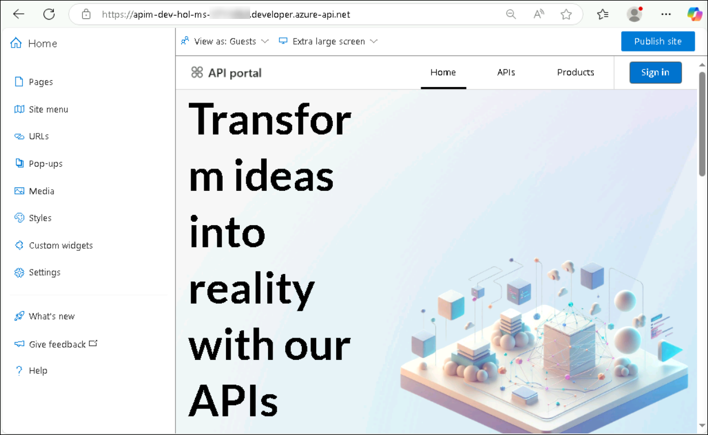
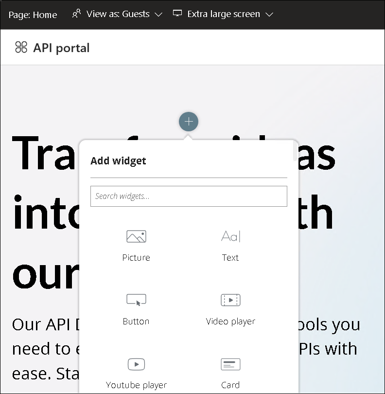

## Continuation for Exercise-2, Task 4: Customizing the Developer Portal (Read-Only)

### Task 4.1: Site Configuration

The Developer Portal is based on a fork of the [Paperbits Web framework](https://paperbits.io/) and is enriched with Azure API Management-specific features. The fork resides at <https://github.com/Azure/api-management-developer-portal>.

It is possible to self-host and manage your own Developer Portal outside of an Azure API Management instance. This is an advanced option, which allows you to edit the portal's codebase and extend the provided core functionality. This is documented at <https://github.com/Azure/api-management-developer-portal/wiki> and <https://docs.microsoft.com/en-us/azure/api-management/api-management-howto-developer-portal>.

Before you make your portal available to visitors, you should personalize the automatically-generated content. Recommended changes include the layouts, styles, and the content of the home page. This is documented at <https://docs.microsoft.com/en-us/azure/api-management/api-management-howto-developer-portal-customize>.

A video on customization is available at <https://www.youtube.com/watch?v=5mMtUSmfUlw>.

In the Azure Portal, Navigate to the Azure API Management instance, and locate the Developer Portal in the overview section. Click to open the **Developer Portal**. Feel free to explore the different options available for customization.

   

   

### Task 4.2: Email Configuration

The templates for the email notifications are managed from the Azure Management Portal, directly on the blade's resource menu.

In the Azure Portal, navigate to the Azure API Management instance, from the left navigation pane, under Deployment + infrastructure, click on **Notifications** 

Look at the available notifications and notifications templates which are customizable.

   

   

### Click on Next from the lower right corner to move on to the next page for further tasks.
