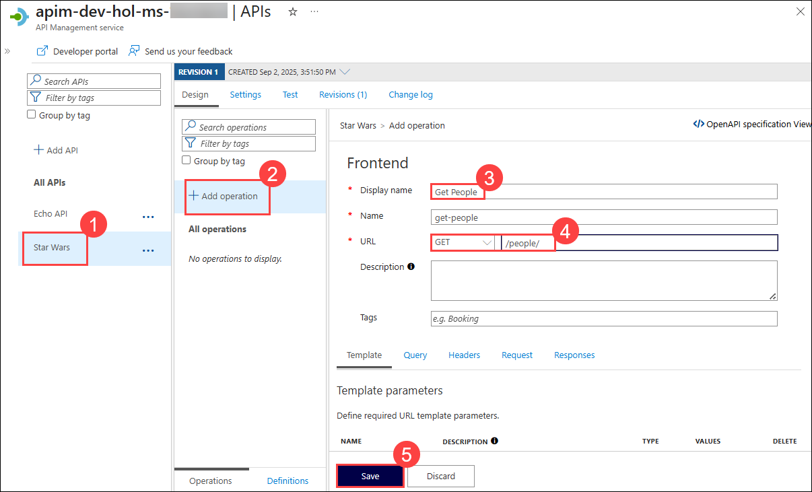
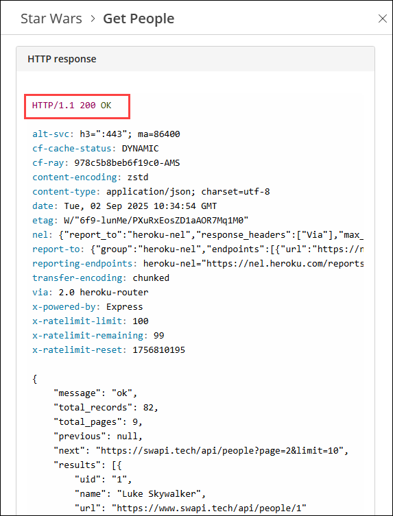
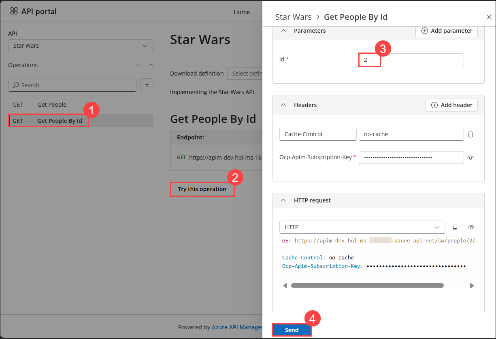
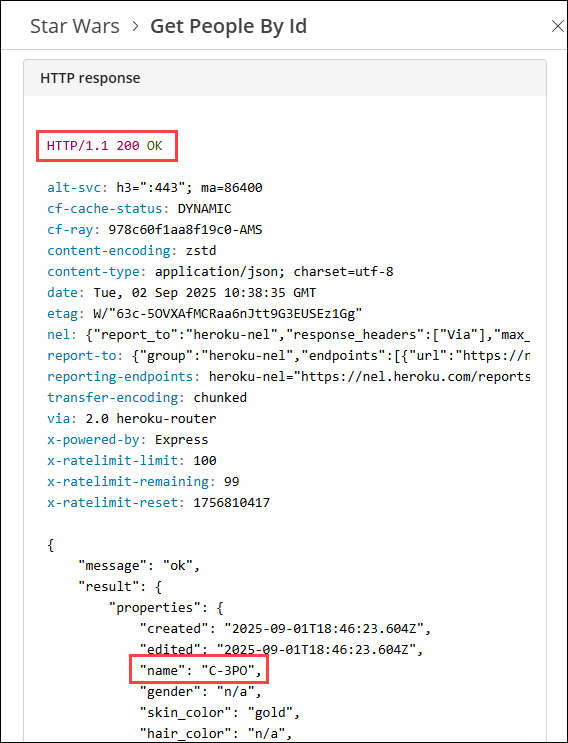

# Exercise 3: Adding APIs

### Estimated Duration: 60 Minutes

## Overview

In this exercise, you will learn how to add APIs to your Azure API Management instance. You will explore different methods of adding APIs, including creating an API from scratch and importing an API using OpenAPI specifications. You will also test the APIs using the Developer Portal.

An API represents a set of operations that can be invoked. New APIs are defined, and then the desired operations are added. An API is added to a product and can be published; it may then be subscribed to and used by developers.

- Navigate back to the Azure portal, on the left menu, select the **_APIs_** blade. You will see all APIs, and the possibility to add new ones, but also to customize existing ones.

  

## Objectives

In this Exercise, you will perform:

- Task 1: Add API from Scratch
- Task 2: Access Star Wars API from Developer Portal
- Task 3: Import API using OpenAPI
- Task 4: Test Rate Limiting Policy
   - Task 4.1: Calling API and testing Subscription Keys
   - Task 4.2: Rate limit

### Task 1: Add API from Scratch

In this task, you will add a new API to your API Management instance from scratch.

Instead of developing an API, for this Exercise, you will use the existing [_Star Wars_ API](https://swapi.dev):

1. Navigate to the Azure API Management instance and expand the **API's (1)** section and select **APIs (2)**. Click on **+ Add API (3)** and select the **HTTP - Manually define an HTTP API (4)**.

   

1. On the Create an HTTP API window, select the **Full (1)** option and enter the following details and click on **Create** **(9)**.

   - Display name: **Star Wars** **(2)**.
   - Name: **star-wars** **(3)**.
   - Description: **Implementing the Star Wars API** **(4)**.
   - Web service URL: **https://swapi.tech/api** **(5)**.
   - URL scheme: **HTTPS** **(6)** as we strive to enforce HTTPS only.
   - API URL suffix: **sw** **(7)**. This allows us to compartmentalize the Azure API Management URLs for distinct APIs.
   - Products : Assign **Starter** and **Unlimited** **(8)**.

     > **Note**: While it is conventionally a good idea to version APIs from the onset, we are omitting this step here for the brevity of the labs.

     

1. Once the API is created, click on the **Star Wars (1)** API and select **+ Add operation (2)** to declare two new operations:

   - Display name: **Get People (3)**
   - Name will be populated with: **get-people**
   - URL: **GET /people/ (4)**
   - Click on **Save (5)**.

     

1. Again click on **+ Add operation (1)** to add another operation and give the following details

   - Display name: **Get People By Id (2)**
   - Name will be populated with: **get-people-by-id**
   - URL: **GET /people/{id}/ (3)**
   - Click on **Save (4)**.

     

   > **Congratulations** on completing the task! Now, it's time to validate it. Here are the steps:
   > - If you receive a success message, you can proceed to the next task.
   > - If not, carefully read the error message and retry the step, following the instructions in the lab guide. 
   > - If you need any assistance, please contact us at cloudlabs-support@spektrasystems.com. We are available 24/7 to help you out.

      <validation step="5394ae8d-6ce9-4ef8-ba57-e7dbff0a416b" />

### Task 2: Access Star Wars API from Developer Portal

In this task, you will access the Developer Portal to explore and test the newly added Star Wars API.

1. Now switch to the **Developer Portal** in the **In-Private** window where you were previously signed in.

2. Select **APIs (1)** on the **Home** page. You should see both **Echo API** and **Star Wars (2)**.

      

3. Click on **Star Wars** API, then select the **Get People (1)** operation. Click **Try this operation (2)**, scroll down, and click **Send (3)**. You should see a successful `200` response. After reviewing it, go ahead and close the panel.

      

      

4. Now go to the **Get People By Id (1)** operation and click on **Try this operation (2)** by entering `id = 2` **(3)** in the **Parameters** section. Then scroll down and click **Send (4)**.

      

5. Examine the successful `200` response with `C-3PO`'s details in the response body payload.

      

---

## Summary

In the above tasks, you added the Star Wars API to Azure API Management, configuring operations for retrieving a list of characters and details by ID. This demonstrates the ability to integrate and manage APIs effectively within the Azure environment

### Now, click on Next from the lower right corner to move on to the next page for further tasks of Exercise 3.

  

