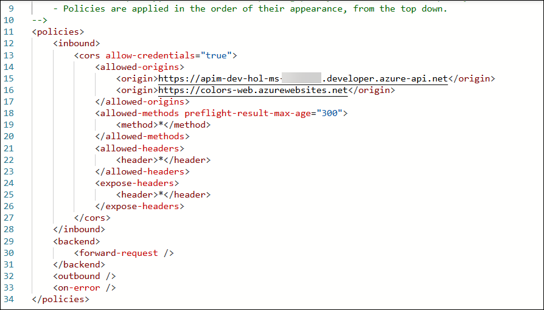

# Exercise 4: Configure and implement policy expression to contol API behaviour and enforce rules.

### Estimated Duration: 50 Minutes

## Overview

In this Ecercise, you will explore and apply different API Management policies such as CORS, caching, transformations, named values, mock responses, and request control.

## Objectives

In this Exercise, you will perform:

- Task 1: Cross-origin resource sharing (CORS) policy
- Task 2: Caching policy
- Task 3: Transformation policies  
    - Task 3.1: Transformation - replace string
    - Task 3.2: Transformation - conditional
    - Task 3.3: Transformation - XML to JSON
    - Task 3.4: Transformation - Delete response headers
    - Task 3.5: Transformation - Amend what's passed to the backend 
- Task 4: Named Values
- Task 5: Mock policy
- Task 6: Send One Way policy
    - Task 6.1: Add Send One Way policy
    - Task 6.2: Send a message to Webhook.site
- Task 7: Abort processing policy

### Task 1: Cross-origin resource sharing (CORS) policy

In this task, you will explore the CORS policy.

The [cors policy](<https://docs.microsoft.com/en-us/azure/api-management/api-management-cross-domain-policies#CORS>) adds cross-origin resource sharing (CORS) support to an operation or an API to allow cross-domain calls from browser-based clients.

1. We have already configured the **CORS** policy for our APIs in Exercise 2 & 3.

1. Navigate to our **Azure API Management** instance, and select **All APIs** from the API section.

1. Click on **CORS** under the **Inbound processing** tab to view the XML present within the **CORS** policy.

    
   
      

### You have successfully completed the exercise. Click on **Next >>** to proceed with the next exercise.

