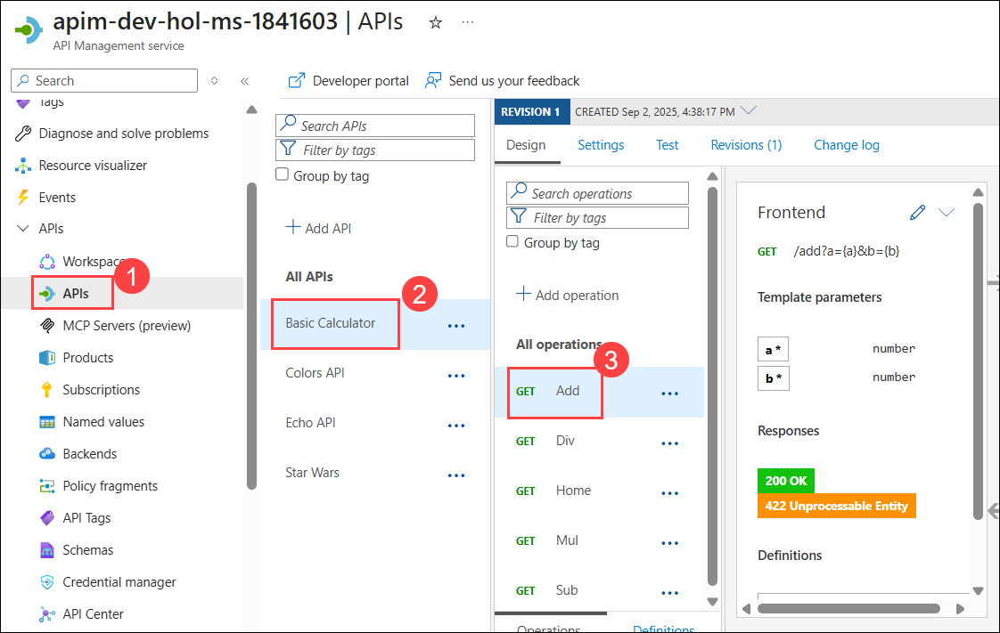

## Exercise 4 Task 4: Named Values

In this task, you will create a Named Value in Azure API Management (APIM) that holds the current timestamp. This Named Value will then be used in the inbound policy of the Calculator API to set a custom header with the current timestamp when an API request is received.

**Named Values** (aka **Properties**) are a collection of key/value pairs that are global to the service instance. These properties can be used to manage `string` constants across all API configurations and policies. Values can be expressions, secrets (encrypted by APIM), or Key Vault, which links to a corresponding secret in Azure Key Vault.

1. Navigate to youa **APIM instance** in the Azure portal. From the left menu, select **Named values (1)** under **APIs** and click on **+ Add (2)** to add a new named value.

    
  
1. On the Add named value window, enter the following details. 

    - Name: **TimeNow** **(1)**
    - Display name: **TimeNow** **(2)**
    - Type: **Plain** **(3)**
    - Value: `@(DateTime.Now.ToString())` **(4)**
    - Click on **Save** **(5)**

      

1. Navigate back in the **APIs (1)** blade, in the **Basic Calculator API (2)**, open the **Add (3)** operation. 

      
    
1. Amend the inbound `set-header` policy by clicking on the pencil icon.

    

1. Create a new header by pressing **+ Add header (1)**:
  
    - Name: **x-request-received-time (2)**
    - Value: `@(DateTime.UtcNow.ToString("MM/dd/yyyy h:mm:ss tt"))` **(3)**
    - Action: **override (4)**
    - Click **Save (5)**

      
      
    - The corresponding XML in the *Code editor* view should look like this: 

      ```xml    
      <inbound>
          <base />
          <set-query-parameter name="x-product-name" exists-action="override">
              <value>@(context.Product?.Name ?? "none")</value>
          </set-query-parameter>
          <set-header name="x-request-context-data" exists-action="override">
              <value>@(context.Deployment.Region)</value>
          </set-header>
          <set-header name="x-request-received-time" exists-action="override">
              <value>@(DateTime.UtcNow.ToString("MM/dd/yyyy h:mm:ss tt"))</value>
          </set-header>
      </inbound>
      ```

1. Go to the **Test (1)** section. In the Template parameters area, enter any integers **(2)** for parameters **a** and **b**. Then, using either the **Starter** or **Unlimited (3)** product, click **Send (4)**.

    .png)

     

1. Examine the backend trace to find the added header with the evaluated named value. On the Test tab, click on **Trace (1)** and then **Trace (2)** from the top menu and select **Backend (3)**.

    ```json
    {
      "name": "x-request-received-time",
      "value": "12/30/2021 6:10:47 PM"
    }
    ```
   

   

   > **Congratulations** on completing the task! Now, it's time to validate it. Here are the steps:
   > - If you receive a success message, you can proceed to the next task.
   > - If not, carefully read the error message and retry the step, following the instructions in the lab guide. 
   > - If you need any assistance, please contact us at cloudlabs-support@spektrasystems.com. We are available 24/7 to help you out.
         
      <validation step="0b2d0949-fa33-4cd3-a097-c56bbc605dcc" />
---

## Summary

In this task, you created a Named Value in Azure API Management (APIM) to hold the current timestamp. You then used this Named Value in the inbound policy of the Calculator API to set a custom header with the current timestamp when an API request is received.

### Now, click on Next from the lower right corner to move on to the next page for further tasks of Exercise 4.

  
