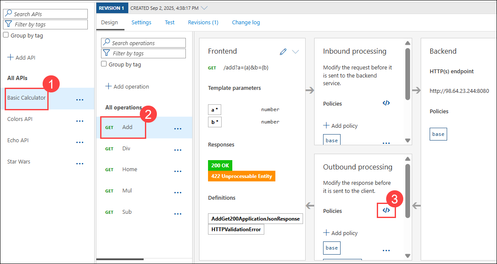
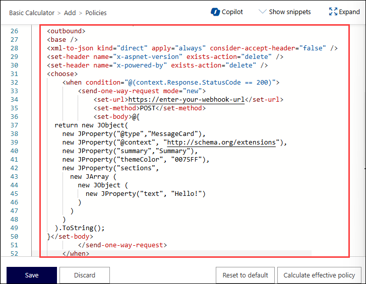
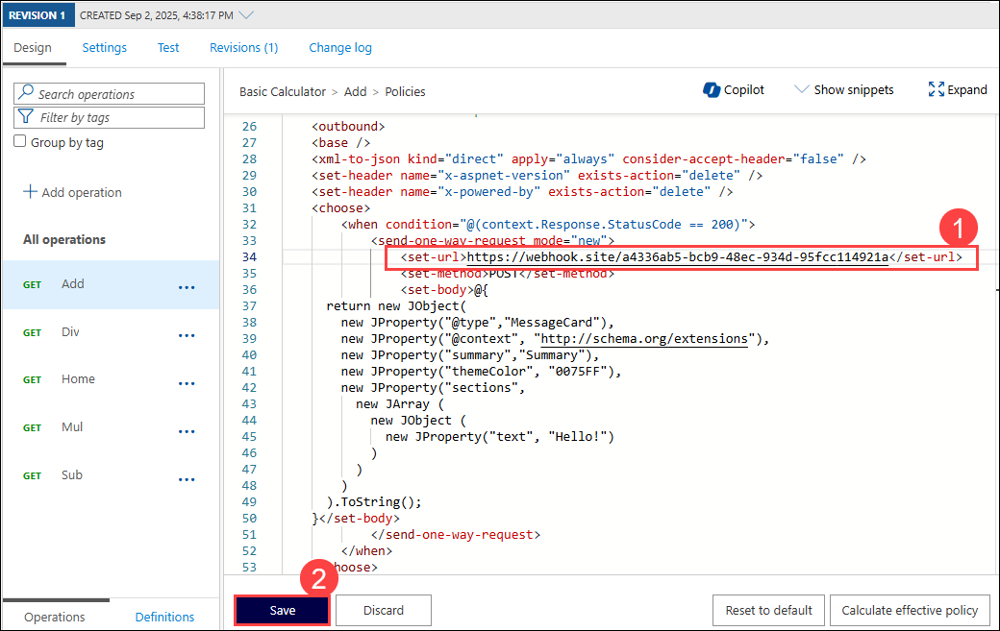
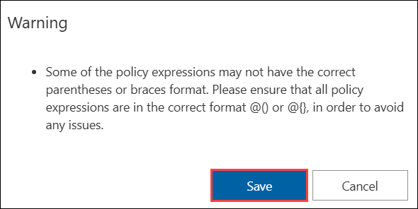
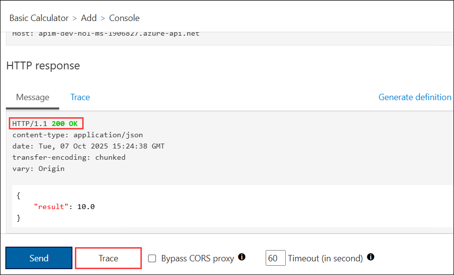
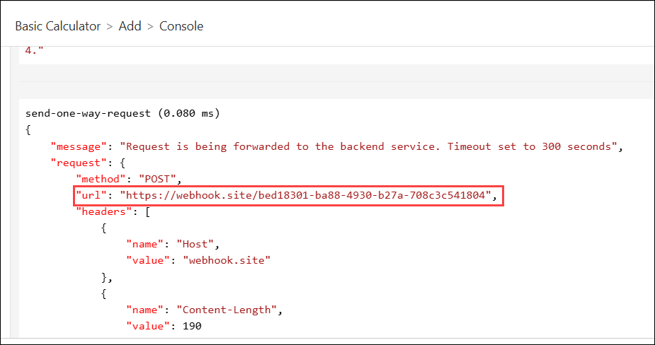

## Exercise 4 Task 6: Send One Way policy

In this task, you will set up a "Send One-Way" policy in Azure API Management (APIM) to send a webhook message without waiting for a response.

APIM integrates well with [external services](https://docs.microsoft.com/en-us/azure/api-management/api-management-sample-send-request) via HTTP-based interaction.

This example shows a fire-and-forget [send-one-way-request](https://docs.microsoft.com/en-us/azure/api-management/api-management-sample-send-request#send-one-way-request) policy, which does not await a response. Alternatively, you can use a [send-request](https://docs.microsoft.com/en-us/azure/api-management/api-management-sample-send-request#send-request) policy to send a request and await a return. Some complex in-flight processing logic may also be better handled by using Logic Apps.

### Task 6.1: Setup the Send-One-Way-Request policy

The following policy and payload applies for both examples in this section (webhook and teams). **Please ensure that you replace the value in `<set-url>` with your webhook target URL.** You will identify the URL in either example below.

1. From **Basic Calculator API (1)** ,select the **Add (2)** operation .

1. In **Outbound Processing** section ,open the **Code View (3)**.

      

1. Add the `send-one-way-request` policy **(1)** to **Outbound processing** and replace the webhook and payload as required. For demo purposes, we are going to use the payload for a Teams message (even for Webhook.site) and also send the message on every successful request.

    >**Note:** Make sure that **Add** operation is selected.

    ```xml
    <outbound>
        <base />
        <xml-to-json kind="direct" apply="always" consider-accept-header="false" />
        <set-header name="x-aspnet-version" exists-action="delete" />
        <set-header name="x-powered-by" exists-action="delete" />
        <choose>
            <when condition="@(context.Response.StatusCode == 200)">
                <send-one-way-request mode="new">
                    <set-url>https://enter-your-webhook-url</set-url>
                    <set-method>POST</set-method>
                    <set-body>@{
          return new JObject(
            new JProperty("@type","MessageCard"),
            new JProperty("@context", "http://schema.org/extensions"),
            new JProperty("summary","Summary"),
            new JProperty("themeColor", "0075FF"),
            new JProperty("sections",
              new JArray (
                new JObject (
                  new JProperty("text", "Hello!")
                )
              )
            )
          ).ToString();
        }</set-body>
                </send-one-way-request>
            </when>
        </choose>
    </outbound>
    ```

          

### Task 6.2: Send a message to Webhook.site

[Webhook.site](https://webhook.site) is a simple recipient to test webhook messages and requires no setup overhead, making this an ideal component in this lab, especially as we are not sending any sensitive information in our payload from our test Azure API Management instance.

1. Go to [Webhook.site](https://webhook.site) and copy the value for **Your unique URL**.

      

1. Use this URL as the value in the `<set-url>` **(1)** property in the `send-one-way-request` policy previously defined and click on **Save (2)**.

      

      > **Note:** Click on **Save** when the warning pop-up appears.

      

1. Go to the **Test (1)** section. In the Template parameters area, enter any integers **(2)** for parameters **a** and **b**. Click **Send (3)**.

    .png)

1. Invoke the API from the Azure API Management **Test** tab by clicking the **Trace** button and observe the `200` success response.

    

1. Check the **Trace** for the **Outbound** one-way message.

      

1. Observe the success in the Webhook site.

      

---
## Summary 

In this task, you set up a "Send One-Way" policy in Azure API Management to send a webhook message without waiting for a response. You successfully sent a test message to Webhook.site and verified the successful delivery of the message.

### Now, click on Next from the lower right corner to move on to the next page for further tasks of Exercise 4.

  
