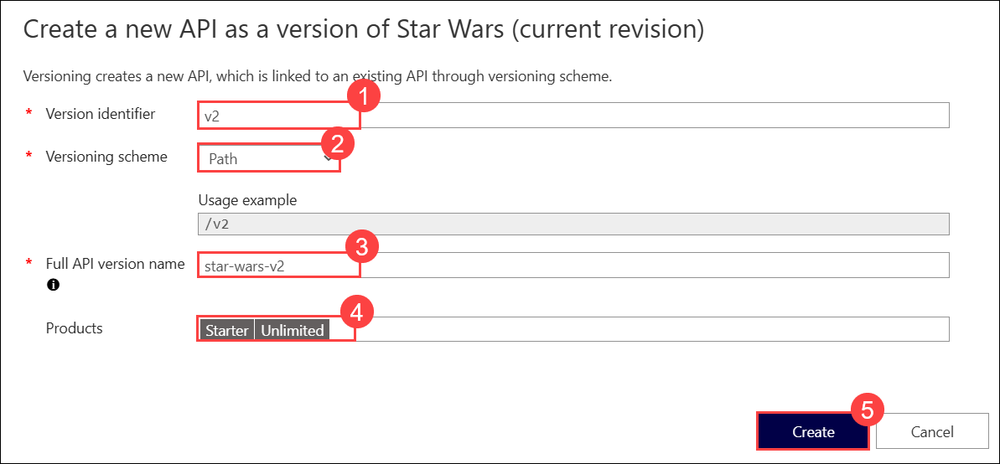
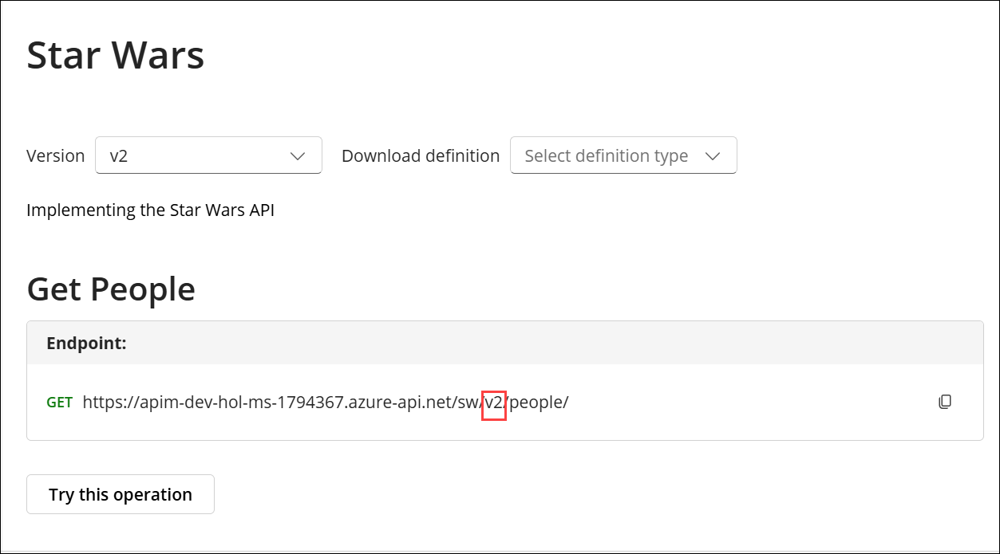
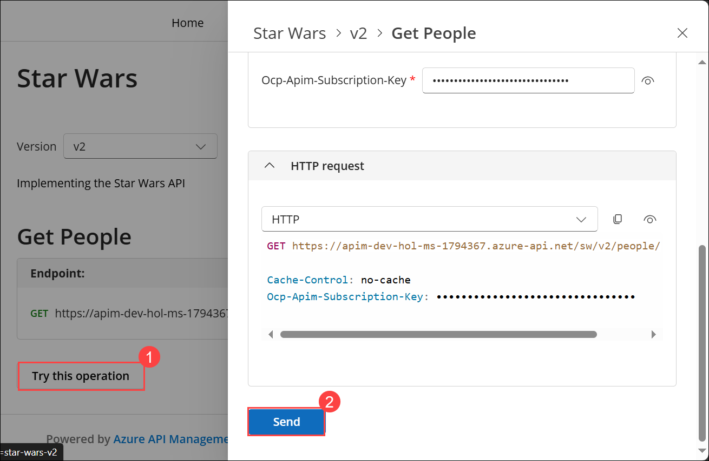

## Task 1: Version

Proper version management not only helps organize your API, it also aids in Azure API Management. In this exercise, we are going to version an existing API.

> Good practice: Integrate version management from the beginning with a **v1** or similar identifier. 

### Task 1.1: Add a new version

1. Select the **Star Wars** API.
1. Click on the ellipsis and select **Add version.**

      
  
1. Add a new version with these values,
    - Version identifier: **v2** **(1)** 
    - Versioning scheme: **Path** **(2)** 
    - Full API version name: **star-wars-v2** **(3)** 
      > This name must be unique across the Azure API Management instance. Therefore, a combination of the API name and its version identifier is both semantic and suitable.
    - Products: **Starter** and **Unlimited** **(4)** 
    -  Click on **Create**: **(5)** 

        

      - The new version, _v2_, is now added to the Star Wars API. 
        > Any previous implementation of the newly-versioned API will simply be set to _Original_. This is a purely organizational change within APIM. The  version continues to operate on the same previous URL without a version identifier - there is no impact on the consumers.

          

### Task 1.2: Test the new version

> Sometimes, the version creation takes just a little bit of time. If you do not see it immediately, please keep refreshing and ensure you select the appropriate version as per the below instructions.

1. Return to the **Developer portal**, refresh the page, and then click on **APIs** at the top.

      

1. Select the `v2` version of the *Star Wars* API.

      

1. Notice the Endpoint URL and the inclusion of `v2` in the path.

      

1. To test the `GetPeople` operation, click on **Try this operation (1)**, then scroll down on the right and click **Send (2)**.

      

1. Review the HTTP response that appears below. 

   > **Congratulations** on completing the task! Now, it's time to validate it. Here are the steps:
   > - If you receive a success message, you can proceed to the next task.
   > - If not, carefully read the error message and retry the step, following the instructions in the lab guide. 
   > - If you need any assistance, please contact us at cloudlabs-support@spektrasystems.com. We are available 24/7 to help you out.

      <validation step="150dd1c5-427a-46c3-88b6-6c18bc0ed5a3" />

### What Versions Enable

Now that you have created a new version of the API, you have the ability to introduce breaking changes. Oftentimes times a breaking change in a backend API necessitates an API version change in APIM. Leaving a legacy implementation behind to focus on more contemporary API implementations also is a common versioning use case. Whatever the reason may be, Azure API Management provides means to abstract breaking changes in a responsible and safe manner.  

### You have successfully completed the exercise. Click on **Next >>** to proceed with the next exercise.
