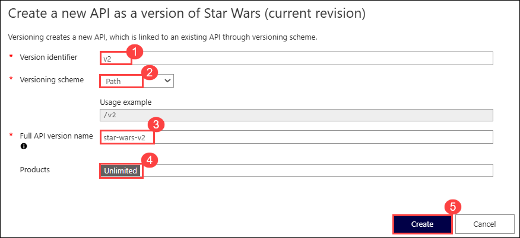
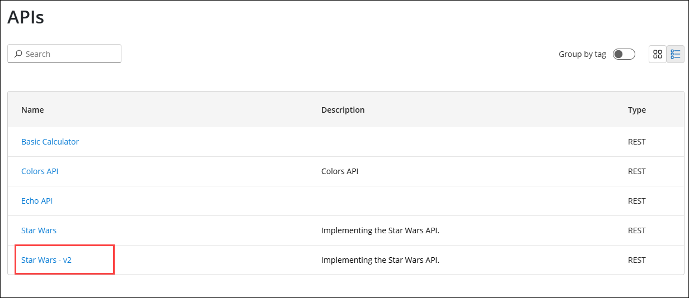
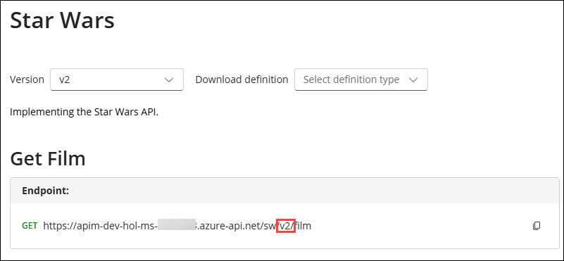

## Exercise 5: Version and Revisions

## Estimated Duration: 60 Minutes

## Overview

In this exercise, you will learn how to manage versions and revisions of your APIs in Azure API Management (APIM).

Versions and revisions provide you with elegant means to safely manage the lifecycle of your APIs. 

Versions of APIs are differentiated by a version identifier (e.g., `v1`, `v2`, etc.) through a versioning scheme such as a version path in the URL, a header, or a query string. Multiple versions can and may often be active at the same time to provide continued service, while breaking changes may be introduced in newer versions.

Revisions allow you to safely make _non-breaking_ changes to your API. Developers who consume the API can be given details about the changes. Revisions can safely be tested before being activated for your consumers. Revisions also allow you to roll back changes. 

For more information, visit the [Versions & Revisions](https://azure.microsoft.com/en-us/blog/versions-revisions) documentation.

## Objectives

In this Exercise, you will perform:

- Task 1: Create a new version of an API
   - Task 1.1: Add a new version
   - Task 1.2: Test the new version
- Task 2: Create a new revision of an API
    - Task 2.1: Add a new revision
    - Task 2.2: Add caching
    - Task 2.3: Test the new revision
    - Task 2.4: Make current revision

### Task 1: Create a new version of an API

In this task, you will create a new version of the existing Star Wars API.

Proper version management not only helps organize your API, but it also aids in Azure API Management. In this exercise, we are going to version an existing API.

> Good practice: Integrate version management from the beginning with a **v1** or similar identifier. 

### Task 1.1: Add a new version

1. From your APIM instance, select the **Star Wars** API.

1. Click on the ellipsis and select **Add version.**

      
  
1. On the **Create a new API as a version of Star Wars (current revision)** window, enter the following details.

    - Version identifier: **v2** **(1)** 
    - Versioning scheme: **Path** **(2)** 
    - Full API version name: **star-wars-v2** **(3)** 
      > This name must be unique across the Azure API Management instance. Therefore, a combination of the API name and its version identifier is both semantic and suitable.
    - Products: **Starter** and **Unlimited** **(4)** 
    -  Click on **Create**: **(5)** 

        

      - The new version, _v2_, is now added to the Star Wars API. 
        > Any previous implementation of the newly versioned API will simply be set to _Original_. This is a purely organizational change within APIM. The  version continues to operate on the same previous URL without a version identifier - there is no impact on the consumers.

          

### Task 1.2: Test the new version

> Sometimes, the version creation takes just a little bit of time. If you do not see it immediately, please keep refreshing and ensure you select the appropriate version as per the instructions below.

1. Return to the **Developer portal** in the incognito window. Refresh the page, and then click on **APIs** at the top.

      

1. Select the `v2` version of the *Star Wars* API.

      

1. Notice the Endpoint URL and the inclusion of `v2` in the path.

      

1. Test the `GetPeople` **(1)** operation, click on **Try this operation (2)**, then scroll down on the right and click **Send (3)**.

      

1. Review the HTTP response that appears below. 

   > **Congratulations** on completing the task! Now, it's time to validate it. Here are the steps:
   > - If you receive a success message, you can proceed to the next task.
   > - If not, carefully read the error message and retry the step, following the instructions in the lab guide. 
   > - If you need any assistance, please contact us at cloudlabs-support@spektrasystems.com. We are available 24/7 to help you out.

      <validation step="150dd1c5-427a-46c3-88b6-6c18bc0ed5a3" />

### What Versions Enable

Now that you have created a new version of the API, you have the ability to introduce breaking changes. Oftentimes times a breaking change in a backend API necessitates an API version change in APIM. Leaving a legacy implementation behind to focus on more contemporary API implementations is also a common versioning use case. Whatever the reason may be, Azure API Management provides a means to abstract breaking changes responsibly and safely.  

## Summary

In this task, you created a new version of an existing API. You also tested the new version to ensure it was functioning correctly.

### Now, click on Next from the lower right corner to move on to the next page for further tasks of Exercise 5.

  

