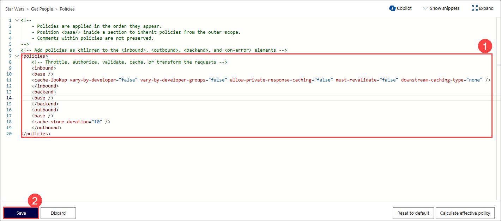
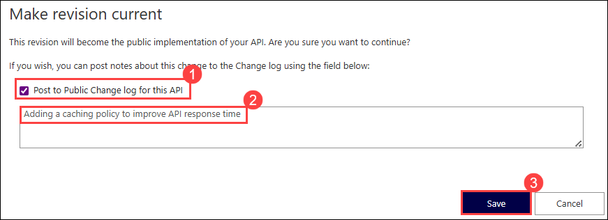

## Exercise 5 Task 2: Create a new revision of an API

In this task, you will create a new revision of the existing Star Wars API version 2.

### Task 2.1: Add a new revision

1. Navigate back to the **APIM instance**, and select the **Star Wars** API **v2**.

      

1. Select the **Revisions (1)** tab and click on **+ Add Revision (2)**

      
  
1. On the **Create a new revision of Stars Wars v2** window, enter the description as `Adding a caching policy` **(1)** and click on **Create (2)**.
  
      

    > The new revision is online but not yet current. The previous revision continues to remain the active default. Having added the new revision has not resulted in any change for your API consumers.

      

### Task 2.2: Add caching

1. Switch to the **Design** tab, then select the `Get People` operation.
    > **Revision 2** automatically became the active revision you are now making changes in. You can also switch between revisions, but **be aware that changes to the *Current* revision are live immediately**.

      

1. Navigate to the **Inbound processing** tab.
   
1. Replace the existing policies **(1)** with the below xml to add a 10-second caching policy for the **GET People** operation via the Code editor and click on **Save (2)**

      

    ```xml
      <policies>
            <!-- Throttle, authorize, validate, cache, or transform the requests -->
            <inbound>
            <base />
            <cache-lookup vary-by-developer="false" vary-by-developer-groups="false" allow-private-response-caching="false" must-revalidate="false" downstream-caching-type="none" />
            </inbound>
            <backend>
            <base />
            </backend>
            <outbound>
            <base />
            <cache-store duration="10" />
            </outbound>
      </policies>
    ```
      
      

1. Once the code is updated, the new `cache-policy` will be created.
   
      

### Task 2.3: Test the new revision

1. Navigate to the **Test** tab from the top, and click on **Trace** button.
  
     > **Note**: The revision number at the top of the page as well as in the request URL. The request URL should look similar to: `https://<your-apim-name>.azure-api.net/sw/v2;rev=2/people/`.

      

1. Test the API twice. The test trace should then show that the cache lookup occurred. 

      

### Task 2.4: Make current revision

1. Now, select the **Revisions (1)** tab. Click on the ellipsis for `rev2` **(2)** and select the **Make Current (3)** option.

      

1. On the **Make revision current** window, check the **Post to the Public Change log for the API (1)** and provide the description as `Adding a caching policy to improve API response time` **(2)**. Click on **Save (3)**.

      

1. The new revision is now the current/live one. When you test now, note that the URL no longer contains a specific revision. The old revision is still online and can now be accessed with the `rev` qualifier. 

    > Unlike versioning, revisioning requires no URL updates for the API consumer.

      


   > **Congratulations** on completing the task! Now, it's time to validate it. Here are the steps:
   > - If you receive a success message, you can proceed to the next task.
   > - If not, carefully read the error message and retry the step, following the instructions in the lab guide. 
   > - If you need any assistance, please contact us at cloudlabs-support@spektrasystems.com. We are available 24/7 to help you out.
   
      <validation step="1f315944-8264-47c9-ab2d-6d4fe20e4f6e" />
--- 

### Summary

In this task you created a new revision of an existing API and added a caching policy to it. You then made the new revision the current one.

### You have successfully completed the Exercise. Click on **Next >>** to proceed with the next exercise.

  
