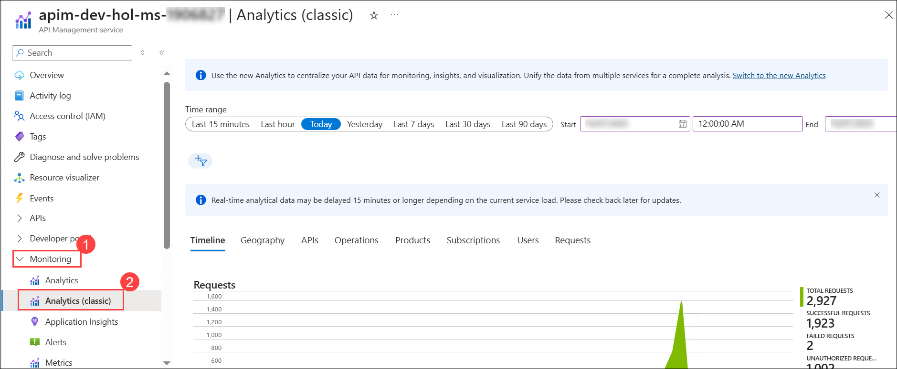
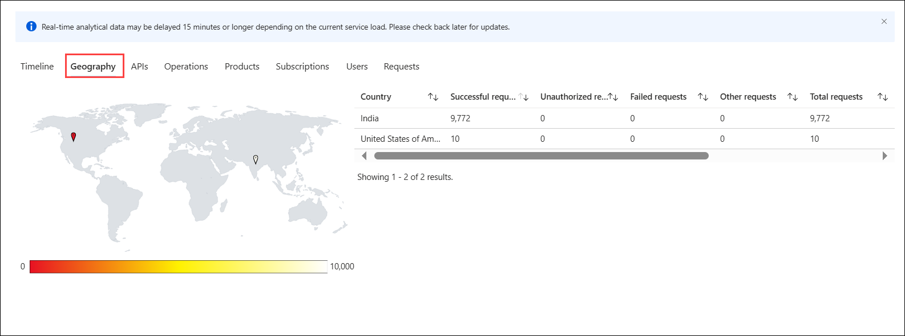

## Exercise 6: Analytics & Monitoring

### Estimated Duration: 60 Minutes

## Overview

In this exercise, you'll set up Azure Monitor and Application Insights to track and analyze API performance. The focus is on collecting metrics, monitoring usage, and gaining insights into API health, which helps optimize performance and ensure the reliability of your API services.

## Objectives

In this exercise, you will perform:

- Task 1: Explore monitoring using Azure Monitor
- Task 2: Integrating Azure API Management with Azure Application Insights

  - Task 2.1: Create an Azure Application Insights instance
  - Task 2.2: Create a connection between Azure Application Insights and the Azure API Management service instance
  - Task 2.3: Enable Application Insights logging for your API
  - Task 2.4: Viewing Azure Application Insights Data

- Task 3: Event Hub Overview

  - Task 3.1: Create an Event Hubs namespace
  - Task 3.2: Create an Event Hub
  - Task 3.3: Create Access to the Event Hub
  - Task 3.4: Create an Azure API Management logger
  - Task 3.5: Configure log-to-eventhub policies
  - Task 3.6: Verify Events are logged in Event Hub

## Task 1: Explore monitoring using Azure Monitor

In this task, you will be exploring the analytics capabilities of Azure API Management using Azure Monitor.

1. In your **APIM instance**, from the left side menu select **Analytics (Classic) (2)** under **Monitoring (1)** section. 

      

1. The dashboard has several tabs on it. For example, here are _Timeline_, _Geography_, and _APIs_:

    - Each tab on the dashboard provides a unique perspective on your API analytics:
  
      - **Timeline**: Visualizes API activity over time, helping you spot trends, spikes, or anomalies in usage.
      - **Geography**: Displays where your API calls originate, allowing you to understand regional usage patterns.
      - **APIs**: Breaks down metrics by individual APIs, so you can compare performance and usage across different endpoints.

    - Exploring these tabs helps you quickly identify issues, monitor performance, and gain insights into how your APIs are being used.
  
        
  
        
  
        

### Now, click on Next from the lower right corner to move on to the next page for further tasks of Exercise 6.

  

