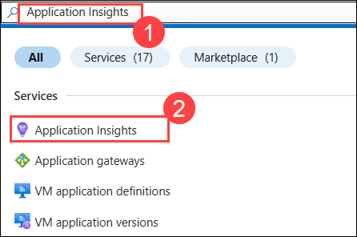
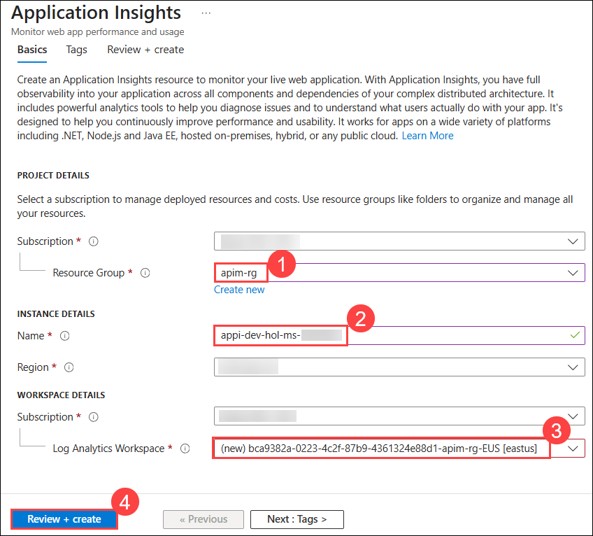
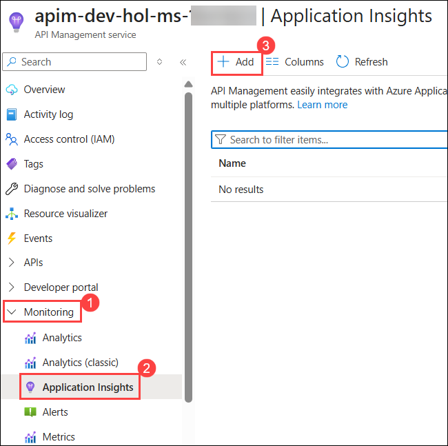
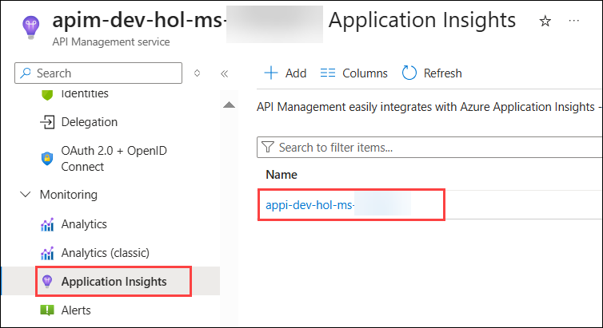
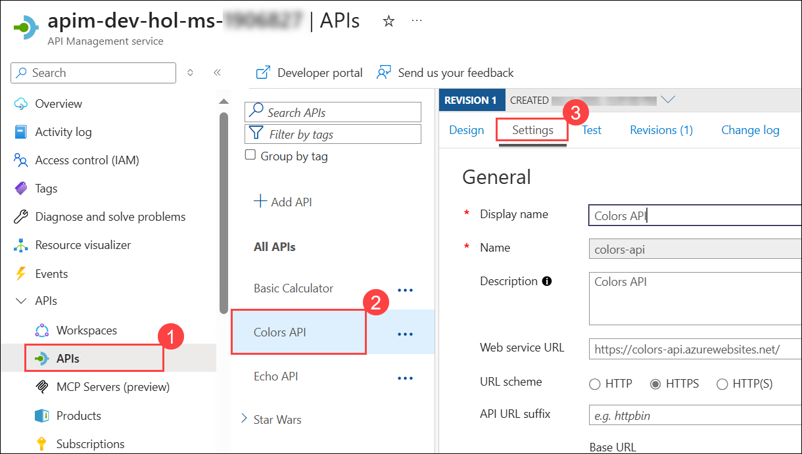
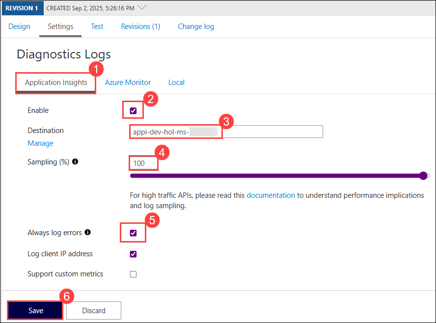
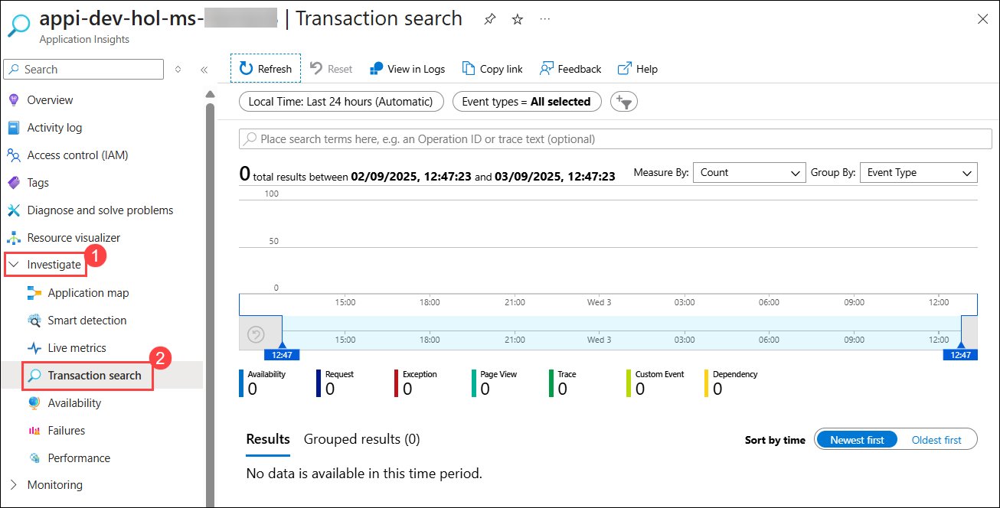

## Exercise 6 Task 2: Integrating Azure API Management with Azure Application Insights

In this task you will be creating an Azure Application Insigths and will integrate it with your Azure API Management instance.

### Task 2.1: Create an Azure Application Insights instance

1. In the search bar of the Azure portal, type **Application Insights (1)**. From the search results, select **Application Insights (2)**.

    

2. Click **+ Create**, then on the **Basics** tab, provide the following information:

    - Resource Group: **apim-rg (1)**
     
    - Name: **appi-dev-hol-ms-<inject key="Deployment ID" enableCopy="false" />** **(2)**

    - Log Analytics Workspace: **Leave as default (3)**

    - Click **Review + create** **(4)**

        

3. Under the **Review + create** tab, click **Create**.

    

   > **Congratulations** on completing the task! Now, it's time to validate it. Here are the steps:
   > - If you receive a success message, you can proceed to the next task.
   > - If not, carefully read the error message and retry the step, following the instructions in the lab guide. 
   > - If you need any assistance, please contact us at cloudlabs-support@spektrasystems.com. We are available 24/7 to help you out.

    <validation step="c50fd98d-9969-4471-95d7-ae0959ed081f" />

### Task 2.2: Create a connection between Azure Application Insights and Azure API Management service instance

1. Navigate to your **APIM** instance in the **Azure portal**.

2. From the menu on the left, select **Application Insights (2)** under the **Monitoring (1)** section and click on **+ Add (3)**

      

3. On the **Add a logger** window that opens on the right side, select the **Application Insights (1)** resource we created in the previous task and click on **Create (2)**.

     
   
4. You have just created an Azure Application Insights logger with an instrumentation key. It should now appear in the list.

    

    > Behind the scenes, a [Logger](https://learn.microsoft.com/en-us/rest/api/apimanagement/logger/create-or-update?view=rest-apimanagement-2024-05-01&tabs=HTTP) entity is created in your Azure API Management instance, containing the Connection String of the Application Insights instance.

   > **Congratulations** on completing the task! Now, it's time to validate it. Here are the steps:
   > - If you receive a success message, you can proceed to the next task.
   > - If not, carefully read the error message and retry the step, following the instructions in the lab guide. 
   > - If you need any assistance, please contact us at cloudlabs-support@spektrasystems.com. We are available 24/7 to help you out.

    <validation step="65dfec7c-e946-478a-8012-7430913523bd" />

### Task 2.3: Enable Application Insights logging for your API

1. In your **APIM Instance**, select **APIs (1)** under APIs from the menu on the left.

2. Click on the **Colors API (2)** and go to the **Settings (3)** tab from the top bar.

    

4. Scroll down to the **Diagnostics Logs** section.

5. On the **Application Insights (1)** tab, select the following details and click on **Save (6)**: 

    - Check the **Enable (2)** box.
    
    - **Destination:** select the logger you just added in the **Application Insights (3)** blade.

    - **Sampling:** **100 (4)**.

    - Check the **Always log errors (5)** checkbox.

      

      > Behind the scenes, a [diagnostic](https://learn.microsoft.com/en-us/rest/api/apimanagement/diagnostic/create-or-update?view=rest-apimanagement-2024-05-01&tabs=HTTP) entity named 'applicationinsights' is created at the API level.

### What data is added to Azure Application Insights

Azure Application Insights receives:

- *Request* telemetry item for every incoming request (*frontend request*, *frontend response*),
- *Dependency* telemetry item for every request forwarded to a backend service (*backend request*, *backend response*),
- *Exception* telemetry item, for every failed request.

A failed request is a request which:

- failed because of a closed client connection, or
- triggered an *on-error* section of the API policies, or
- has a response HTTP status code matching 4xx or 5xx.

### Generating Test Requests

Any request you make to the Colors API in Azure API Management will be subject to being received by Application Insights (recall the 100% sampling). To generate a large amount of requests quickly, you can invoke the API via the [Colors](https://colors-web.azurewebsites.net) website. As we are presently caching the output for 15 seconds, you may get a lot of requests with the same color. Please feel free to disable the output caching in the Colors API if you would like to see more variety.

### Task 2.4: Viewing Azure Application Insights Data

1. Navigate back to the **Application Insights** blade in your **APIM instance** and click on the Application Insights instance to open it.

1. On the left hand side pane, click on the **Transaction search (2)** under **Investigate (1)** to see details on a transactional level.

    

    >**Note:** Click on **See all data in the last 24 hours**, to see the data.

    

1. In the Application Insights instance, you should be able to see logs and metrics after a few seconds.

1. Unselect **Availability** from Event Types.

    

    > **Note:** The logs may take up to 30 minutes to appear. Kindly continue with the next exercise and check back later.

### Performance implications and log sampling

Logging all events may have serious performance implications, depending on incoming request rate, payload size, etc.

Based on internal load tests, enabling this feature caused a 40%-50% reduction in throughput when the request rate exceeded 1,000 requests per second. Azure Application Insights is designed to use statistical analysis for assessing application performances. It is not intended to be an audit system and is not suited for logging each individual request for high-volume APIs.

You can manipulate the number of requests being logged by adjusting the **Sampling** setting (see the steps above). 100% means all requests are logged, while 0% reflects no logging at all. **Sampling** helps to reduce the volume of telemetry, effectively preventing significant performance degradation, while still carrying the benefits of logging.
Sampling is an effective tool in diagnosing often general operational issues. For example, sampling can identify connectivity or integration issues as these would often occur in high quantity, not singular instances. A sampling rate of 50% is as effective in diagnosing such issues as 100% is.

Skipping logging of headers and body of requests and responses will also have a positive impact on alleviating performance issues.

### Now, click on Next from the lower right corner to move on to the next page for further tasks of Exercise 6.

  

