## Exercise 6 Task 3: Event Hub Overview

In this task you will be creating an Azure Event Hub and will integrate it with your Azure API Management instance.

[Azure Event Hubs](https://azure.microsoft.com/en-us/services/event-hubs/#overview) is a fully managed, real-time data ingestion service. Millions of events per second can be aggregated to build dynamic data pipelines. 

We can use Event Hubs with Azure API Management to obtain analytics of our API usage.

### Task 3.1: Create an Event Hubs namespace

In this task, you will create an Event Hubs namespace in your resource group.

An Event Hubs namespace provides a unique scoping container in which you create one or more event hubs. To create a namespace in your resource group using the Azure portal, follow these steps:

1. In the search bar of the Azure portal, type **Event Hubs (1)**. From the search results, select **Event Hubs (2)**.

    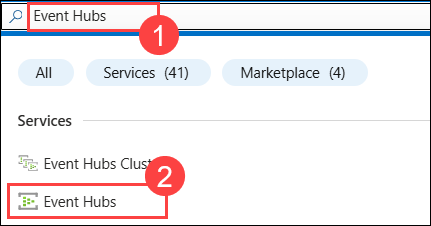

1. Click on **Create** and on the Create Namespace page. enter the following details:

    - Subscription : Select the default subscription **(1)**
    - Resource Group : Select **apim-rg (2)**
    - **Namespace name** : **evhns-dev-hol-ms-<inject key="Deployment ID" enableCopy="false" /> (3)**
    - **Location** : Select the region of your APIM instance **(4)**.
    - **Pricing Tier**: Choose **Basic (5)** for the dropdown.   
    - **Throughput Units** : Leave as default **(6)**. 
    - Select **Review + Create (7)** at the bottom of the page, followed by **Create**.
      
        

1. Once it has been created, select **Go to resource** and confirm that you see the **Event Hubs Namespace** page similar to the following:   
      
    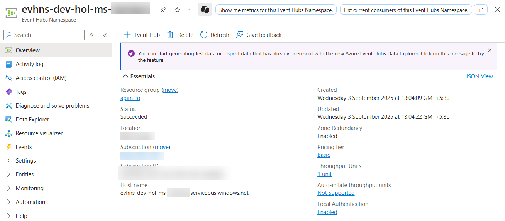


   > **Congratulations** on completing the task! Now, it's time to validate it. Here are the steps:
   > - If you receive a success message, you can proceed to the next task.
   > - If not, carefully read the error message and retry the step, following the instructions in the lab guide. 
   > - If you need any assistance, please contact us at cloudlabs-support@spektrasystems.com. We are available 24/7 to help you out.
   
    <validation step="8c241828-0198-4596-a1f0-4b70ef4fb3aa" />


### Task 3.2: Create an Event Hub

We will create an Event hub to receive logs from our APIM. To create an event hub within the namespace, follow these steps:

1. From the **Event Hubs Namespace**, go to **Event Hubs (1)** under Entities and select **+ Event Hub (2)**
   
    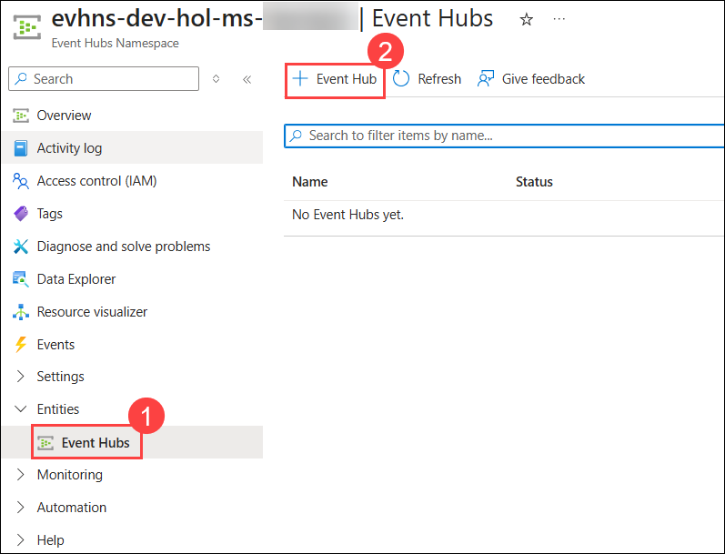

1. On the **Create Event Hub** page, type a name for your event hub : **evh-logger-dev-hol-ms-<inject key="Deployment ID" enableCopy="false" />** , then select **Review + Create**, and click on the **Create**. 

      

    >**Note:** The **partition count** setting allows you to parallelize consumption across many consumers. For more information, see [Partitions](https://learn.microsoft.com/en-us/azure/event-hubs/event-hubs-features#partitions).

    >**Note:** The **message retention** setting specifies how long the Event Hubs service keeps data. For more information, see [Event retention](https://learn.microsoft.com/en-us/azure/event-hubs/event-hubs-features#event-retention).

1. After the event hub is created, you see it in the list of event hubs.

    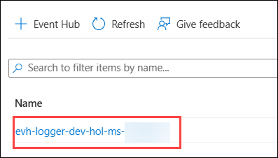

   > **Congratulations** on completing the task! Now, it's time to validate it. Here are the steps:
   > - If you receive a success message, you can proceed to the next task.
   > - If not, carefully read the error message and retry the step, following the instructions in the lab guide. 
   > - If you need any assistance, please contact us at cloudlabs-support@spektrasystems.com. We are available 24/7 to help you out.

    <validation step="3fefc0a6-157b-4820-a57b-5bd7a536f3df" />


### Task 3.3: Create Access to the Event Hub

1. Click on the newly-created event hub.

1. From the left menu, open the **Shared access policies (1)** blade under **Settings** tab and click on + **Add (2)**.

1. On the Add SAS Policy window that opens on the right side of your screen, enter Policy name as **sendpolicy (3)** and check the **Send (4)** permissions. Click on **Create (5)**.

    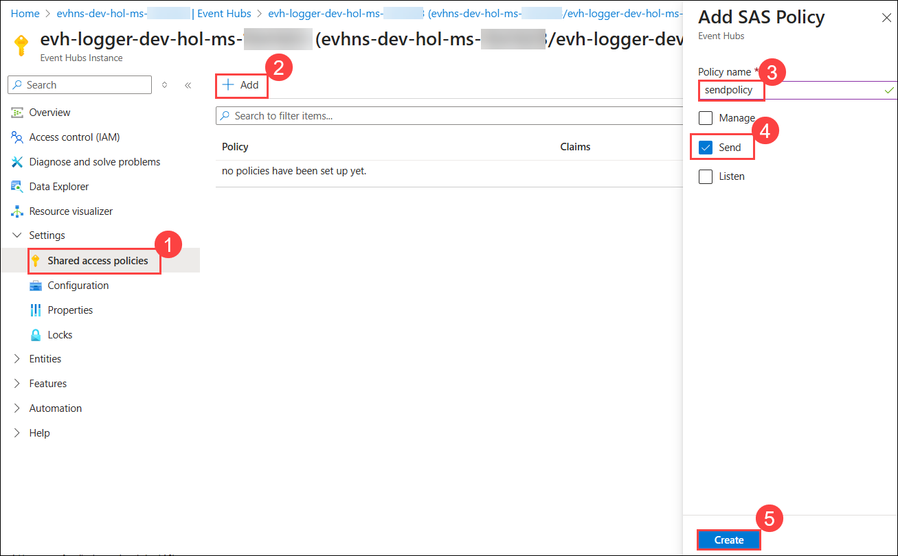

1. Open the new policy created and copy the **Primary connection string** to a notepad. Also, copy the **Event Hub namespace**. You will use both values in the next section.

    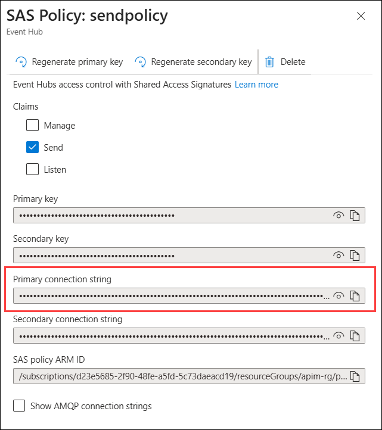

    


### Task 3.4: Create an Azure API Management logger

Now that you have an Event Hub, the next step is to configure a [Logger](https://docs.microsoft.com/en-us/rest/api/apimanagement/current-ga/logger) in your Azure API Management service, so that it can log events to the Event Hub.

Azure API Management loggers are configured using the [API Management REST API](https://docs.microsoft.com/en-us/rest/api/apimanagement/ApiManagementREST/API-Management-REST). For this task we are going to use the "REST API Try it" Functionality to create the logger:

1. Open the following link [REST API Try It](https://docs.microsoft.com/en-us/rest/api/apimanagement/current-ga/logger/create-or-update) in a new browser tab in your Lab VM.

    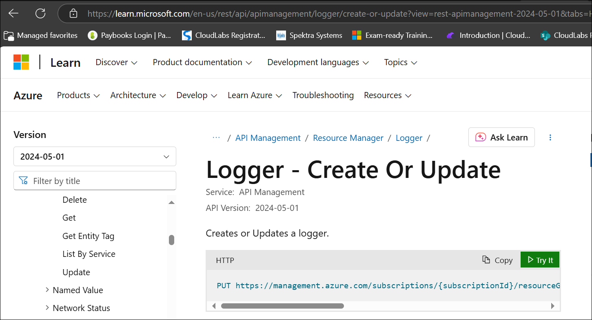

1. In the **Creates or Updates a logger**, click on **Try It (1)** and select **Sign in (2)**.

     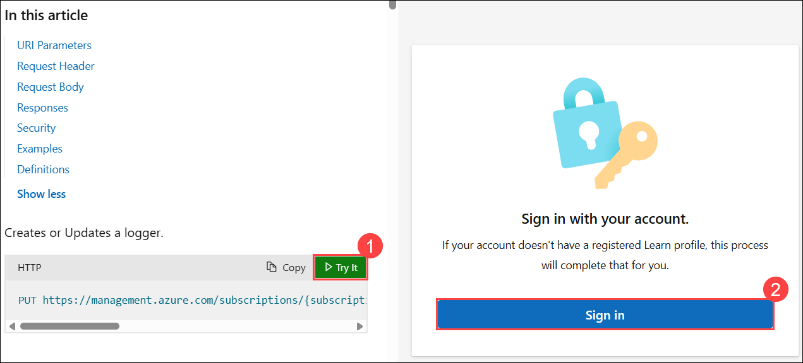

1. Use the  Azure credentials to sign in. Enter the following email/username and then click on **Next**. 

    - Email/Username: <inject key="AzureAdUserEmail"></inject>

1. Now enter the following password and click on **Sign in**.

     - Password: <inject key="AzureAdUserPassword"></inject>

    > **Note:** If Create your profile window shows up, click on **Next**, and  enter any display name and click on **Next**. Select any location and **Save** and click on **Back to learn** 

     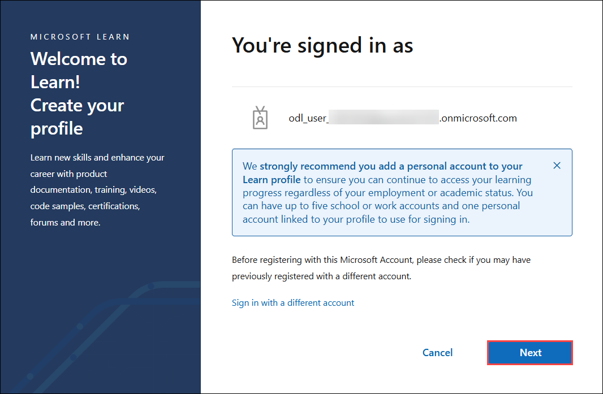  

         

1. Once you have signed in successfully, the Rest API window will open on the right side of the screen. 

1. Enter the following details in the **Parameters** section:

    - LoggerId: **event-hub-logger (1)** (you will use it in the next steps)
    - ResourceGroupName: **apim-rg (2)** 
    - ServiceName: **apim-dev-hol-ms-<inject key="Deployment ID" enableCopy="false" /> (3)**
    - SubscriptionId: Select the subscription given by default **(4)**.
    - api-version: **2018-01-01 (5)**

        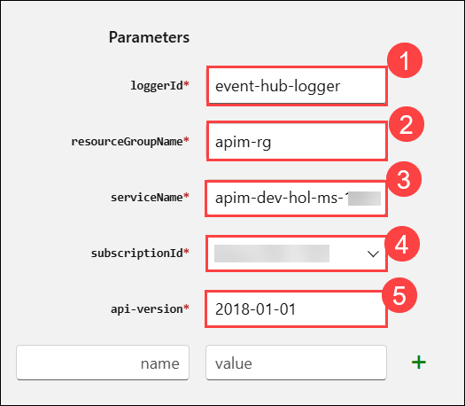

1. Replace the request **Body (1)** with the following json. Make sure you replace the parameters appropriately and press **Run (2)**:

    ```json
    {
        "properties": {
            "loggerType": "azureEventHub",
            "description": "adding a new logger",
            "credentials": {
                "name": "<your event hub namespace>",
                "connectionString": "<your Connection string-primary key>"
            }
        }
    }
    ```

        

    >**Note:** Update the name of the **Events Hub Namespace** and the **Shared Access key** which we copied earlier in the notepad.

1. You should get a **201** response, confirming that the resource has been created.

    


### Task 3.5: Configure log-to-eventhub policies

Once your logger is configured in Azure API Management, you can configure your log-to-eventhub policy to log the desired events. The log-to-eventhub policy can be used in either the **inbound** policy section or the **outbound** policy section.

1. Navigate back to your **APIM Instance** in Azure portal.

1. Go to **APIs (1)** and select the API to which you want to add the policy. In this example, we're adding a policy to the **Echo API (2)**.

1. Select the **Design (3)** tab and click on **All operations (4)**.

      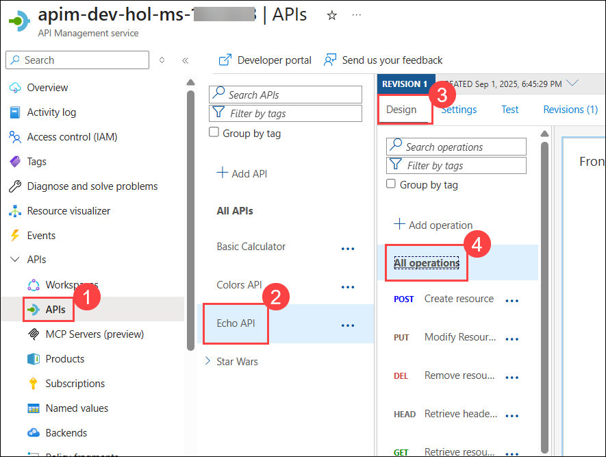
   
1. In the **Inbound** or **Outbound** processing window, enter the Code editor.
1. Enter a new line after the `<base />` tag in the `inbound` or `outbound` policy section.
1. Select **Show snippets**.
1. In the right-hand pane, click on **Hide Snippets**, scroll down to the **Advanced policies** section, and select **Log to EventHub**. This will insert a template for the `log-to-eventhub` policy statement.

    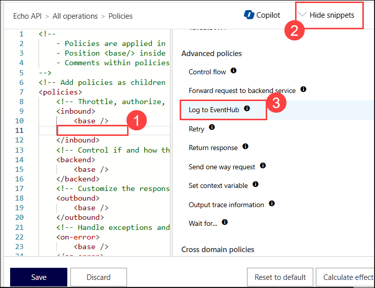

1. Replace the entire code block with the snippet provided below to ensure there are no errors in the policy configuration:

    ```
    <!--
        - Policies are applied in the order they appear.
        - Position <base/> inside a section to inherit policies from the outer scope.
        - Comments within policies are not preserved.
    -->
    <!-- Add policies as children to the <inbound>, <outbound>, <backend>, and <on-error> elements -->
    <policies>
        <!-- Throttle, authorize, validate, cache, or transform the requests -->
        <inbound>
            <base />
            <log-to-eventhub logger-id="event-hub-logger">@{
                    return new JObject(
                        new JProperty("EventTime", DateTime.UtcNow.ToString()),
                        new JProperty("ServiceName", context.Deployment.ServiceName),
                        new JProperty("RequestId", context.RequestId),
                        new JProperty("RequestIp", context.Request.IpAddress),
                        new JProperty("OperationName", context.Operation.Name)
                    ).ToString();
                }</log-to-eventhub>
        </inbound>
        <!-- Control if and how the requests are forwarded to services  -->
        <backend>
            <base />
        </backend>
        <!-- Customize the responses -->
        <outbound>
            <base />
        </outbound>
        <!-- Handle exceptions and customize error responses  -->
        <on-error>
            <base />
        </on-error>
    </policies>
    ```

1. Notice in the above code we have replaced `<your logger id>` with `event-hub-logger` which we used in the request URL to create the logger in the previous task.

    > You can use any expression that returns a string as the value for the `log-to-eventhub` element. In this example, a string in JSON format containing the date and time, service name, request ID, request IP address, and operation name is logged.

    

1. Click **Save** to update the policy configuration. As soon as it is saved the policy is active and events are logged to the designated Event Hub.


### Task 3.6: Verify Events are logged in Event Hub

1. Test a handful of test Echo API calls from within Azure API Management (e.g. **Get Retrieve Resource** operation).

1. In the Azure portal, navigate to your **Event Hub Namespace** you created earlier. You should see recent events. If not, give it a minute, then refresh.

    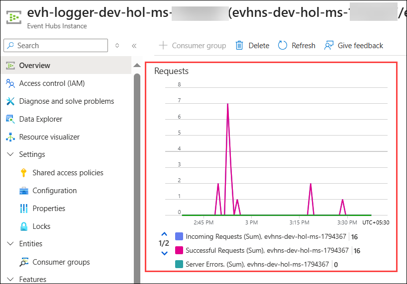

    >**Note:** What to do with the data that is now in Event Hub is beyond the scope of this lab as this lab primarily focused on Azure API Management to Event Hub integration.


## Summary 

In this Task, Azure Event Hubs are integrated with Azure API Management (APIM) for API analytics. This involves creating an Event Hubs namespace, configuring an event hub, setting up access, creating an APIM logger, and configuring policies to log events to Event Hubs, providing real-time API usage tracking and monitoring.

### You have successfully completed the Exercise. Click on **Next >>** to proceed with the next exercise.

  

